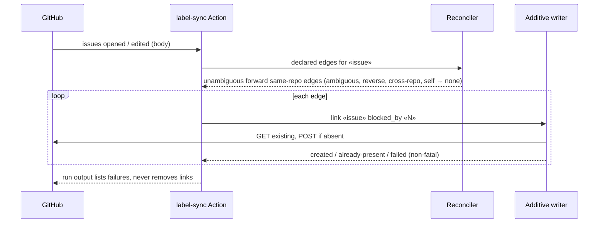
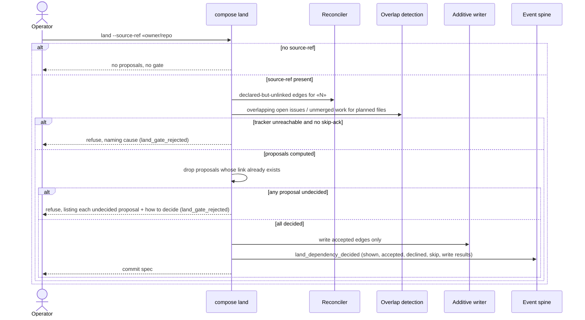
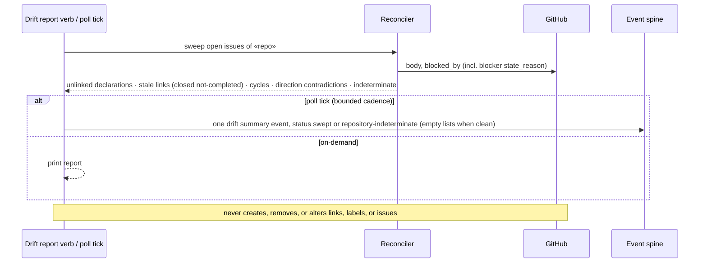

# Sequences: Dependency Edge Authoring and Verification (#536)

**Last updated:** 2026-10-09
**Scope:** The three runtime flows: prose linking on issue events, the land-time proposal gate,
and the read-only drift pass.

## Flow 1: Prose declaration becomes a link

## Flow 2: Land-time proposal gate (intake ideas only)

## Flow 3: Drift pass (on-demand and on-poll)

## Change Log

| Date | Change | Reason |
|------|--------|--------|
| 2026-10-09 | Initial generation | DECIDE for #536 |
