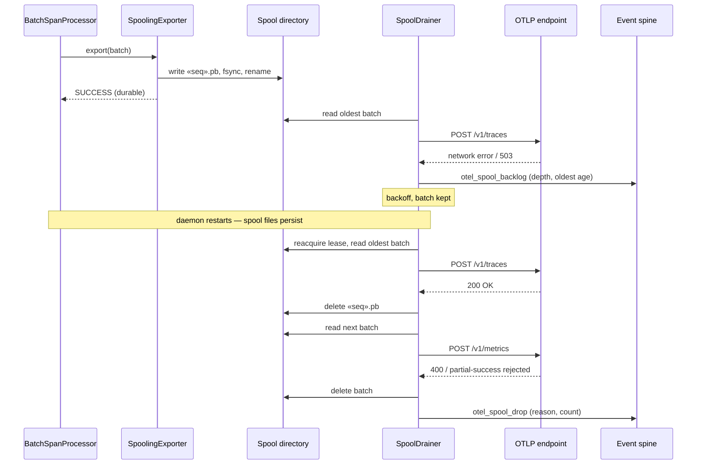

# Sequence: Durable OTel export spool — outage and recovery

**Last updated:** 2026-09-29
**Scope:** One span batch through the spool while the OTLP endpoint is unreachable, across a
daemon restart, then drained on recovery; includes a permanent backend rejection.

## Diagram

## Legend

- Durability boundary is the rename: before it the batch is SDK memory, after it the batch
  survives any process death.
- Guillemets mark variable parts of a label (`«seq»`).

## Change Log

| Date | Change | Reason |
|------|--------|--------|
| 2026-09-29 | Initial generation | DECIDE for durable OTel export queue |
