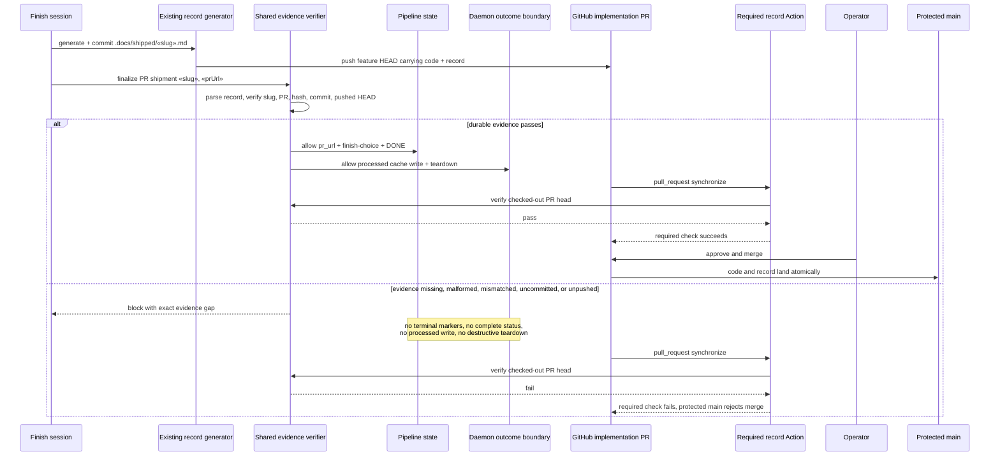

# Sequence: fail-closed shipment and protected-branch check (#916, #936)

**Last updated:** 2026-07-25
**Scope:** Normal engine-driven shipment, the missing-evidence failure path, and GitHub's required
pre-merge check. The same verifier governs every path.

## Diagram

## Legend

- The engine and Action consume one verifier contract; neither re-implements shipped-record
  semantics.
- `finish-record` remains the terminal local-state writer, but only after durable verification.
- Branch protection turns the Action from an advisory signal into a merge gate.
- Keep/discard outcomes do not claim shipment and do not require or create shipped records.

## Change Log

| Date | Change | Reason |
|------|--------|--------|
| 2026-07-25 | Initial generation | Prevent engine and GitHub merge paths from completing without durable evidence |
