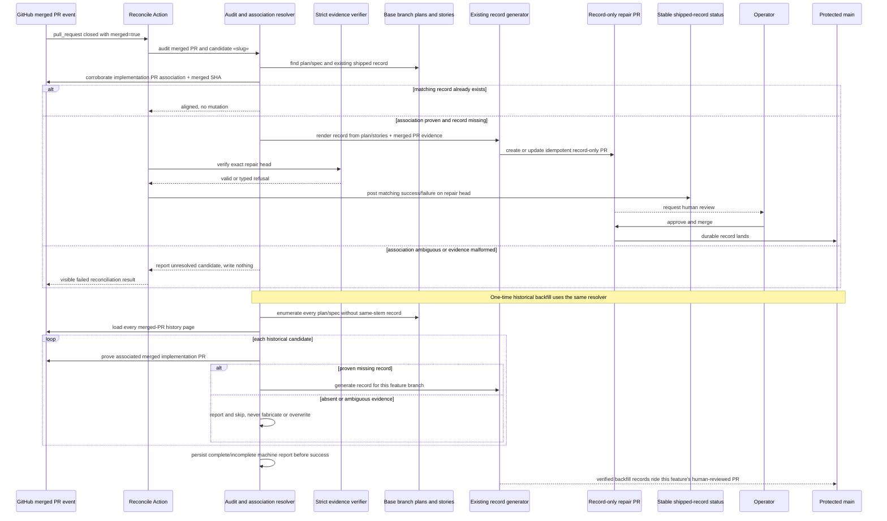

# Sequence: post-merge reconciliation and historical backfill (#916)

**Last updated:** 2026-07-25
**Scope:** Recovery when a merged implementation PR lacks its record and the one-time repository
audit. Both paths fail closed on uncertain plan-to-PR association.

## Diagram

## Legend

- The post-merge Action handles bypasses and legacy races; it opens a repair PR rather than
  pushing directly or auto-merging.
- Existing accurate records are immutable. Repeated Action runs converge on the same repair PR or
  no-op once the record lands.
- The creating Action posts the stable status after verifying the exact repair head, so token-created
  repair PRs remain human-mergeable without relying on a recursive PR event.
- Historical backfill is broader than the local processed ledger: it begins with every plan/spec,
  then writes only where the merged implementation association is proven.
- A failed/ambiguous reconciliation is observable but non-destructive.
- Record rendering keeps the current schema and hash/story-resolution semantics; historical identity
  migration is not part of repair or backfill.

## Change Log

| Date | Change | Reason |
|------|--------|--------|
| 2026-07-25 | Initial generation | Automate detection and PR authoring while preserving human merge approval |
| 2026-07-25 | Added repair-head status and durable audit report | `/plan` fixed retry/status behavior and complete-history proof before backfill success |
| 2026-07-25 | Preserved current record identity semantics | Scope reduction treats #943 as valid and avoids an unrelated historical hash migration |
