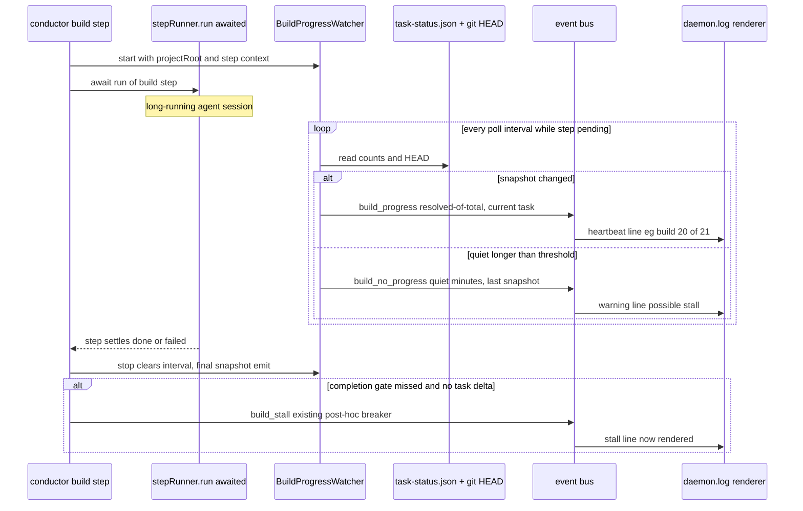

# Sequence: Build-progress watcher lifecycle (issue #347)

**Last updated:** 2026-07-10
**Scope:** One daemon-mode build step from entry to settle — watcher start/stop,
change-driven `build_progress`, quiet-threshold `build_no_progress`, and how the
existing post-hoc stall breaker composes with the new intra-step signal.

## Diagram

## Legend

- Watcher runs only while the awaited `stepRunner.run` promise is pending and only
  for the build step; `stop()` is called in a `finally` so a throwing step cannot
  leak the interval.
- `build_no_progress` is emitted at most once per quiet episode (re-armed when
  progress resumes) — it is a signal, not a page every poll tick.
- The post-hoc breaker (`build_stall`) is unchanged; the watcher neither replaces
  nor gates it. Both feed the same bus so #280's halt-vs-continue decision gets
  intra-step data plus the terminal verdict.

## Change Log

| Date | Change | Reason |
|------|--------|--------|
| 2026-07-10 | Initial generation | DECIDE phase for issue #347 |
