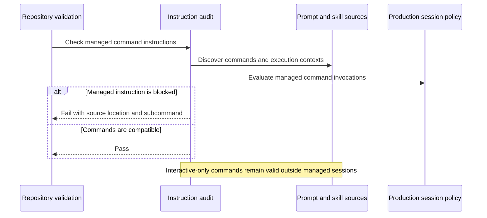
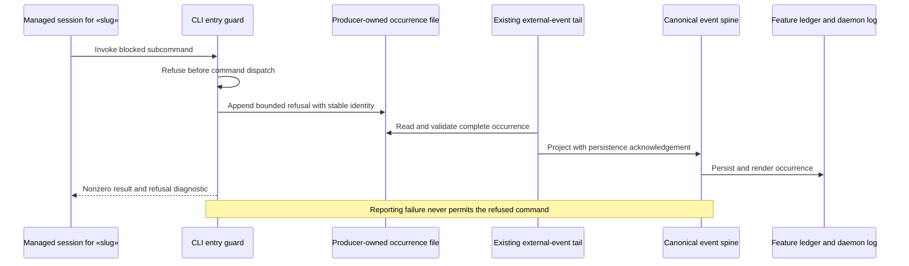
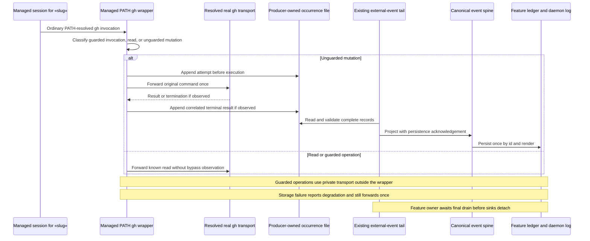

# Sequences: Daemon session command compatibility and visibility

**Last updated:** 2026-10-02
**Scope:** Three primary flows for #2709. These describe proposed observable behavior and ownership; the architecture review owns concrete interception and transport decisions.

## Pre-merge instruction compatibility

## Runtime command refusal

## GitHub bypass visibility

## Legend

Participants are responsibility boundaries, not additional services. Ledger and log are existing consumers of the shared event schema. Cross-process delivery uses separate producer files carrying the existing event schema, projected through the existing tail; canonical persistence acknowledges durable delivery and deduplicates replay. The visibility flow does not itself grant authorization or require a new blocking policy.

## Change Log

| Date | Change | Reason |
|------|--------|--------|
| 2026-10-01 | Initial three-flow view | DECIDE for #2709 |

| 2026-10-02 | Plan update: producer files, acknowledged projection, private transport and drain | Make approved ownership concrete for Tasks 10–19 |
