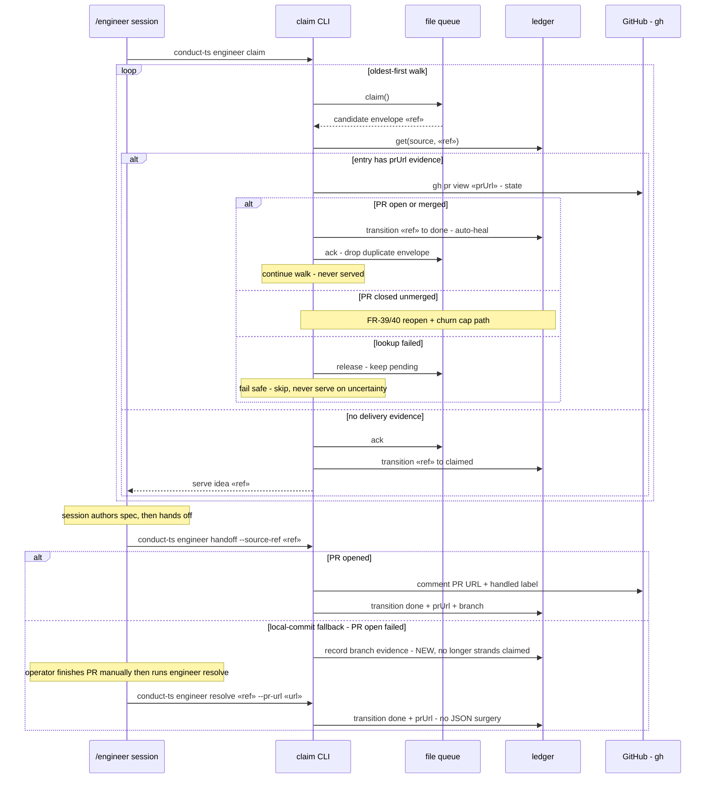

# Sequence: Guarded claim walk + delivery-evidence recording (#243)

**Last updated:** 2026-07-04
**Scope:** The `engineer claim` walk with the delivery guard, and the `engineer handoff`
delivery paths that record evidence. Shows the exact #200/#234 strand scenario being
neutralized.

## Diagram

## Legend

- `«ref»` = the intake sourceRef (e.g. `owner/repo#N`); `«prUrl»`/`«url»` = the spec PR URL.
- The **auto-heal** branch is the #200/#234 fix: an entry stranded at `claimed` with a
  recorded `prUrl` is healed to `done` and its duplicate envelope dropped, instead of being
  served to a fresh session.
- The **local-commit** branch closes the strand source: delivery evidence is recorded even
  when `gh pr create` fails (#290 gh ENOENT family).

## Change Log

| Date | Change | Reason |
|------|--------|--------|
| 2026-07-04 | Initial generation | #243 claim delivery guard spec (engineer DECIDE) |
