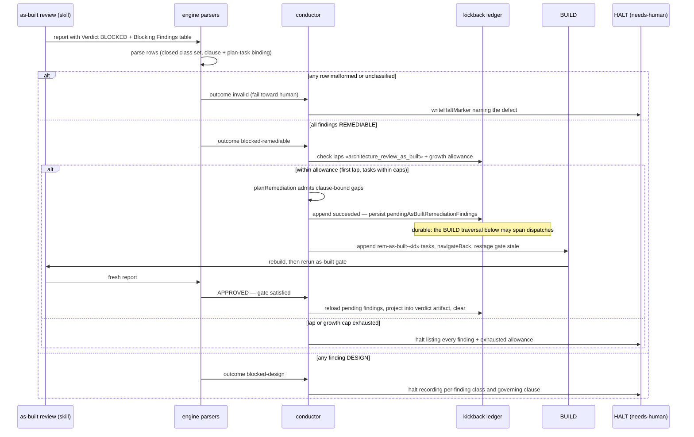

# Sequence: As-Built BLOCKED — Remediable Convergence vs Design Halt

**Last updated:** 2026-08-26
**Scope:** issue #1874 — the two BLOCKED paths after per-finding classification, plus the
fail-closed and cap-exhaustion terminals.

## Diagram

## Legend

- «architecture_review_as_built» — the new gate key in the existing gate-keyed ledger.
- A surviving finding never loops: the second lap is a halt, not another remediation.
- The operator can read afterward which findings were remediated and against which approved
  clause (verdict artifact + shipped record projection).
- That record survives a restart because the pending set is durable ledger state (ADR decision
  7); it is cleared by the same step that projects it, so it never outlives the projection.

## Change Log

| Date | Change | Reason |
|------|--------|--------|
| 2026-08-25 | Initial generation | DECIDE for issue #1874 |
| 2026-08-26 | Added the pending-findings persist and project-then-clear steps | Operator amendment approving ADR decision 7 (as-built finding AB-D1) |
