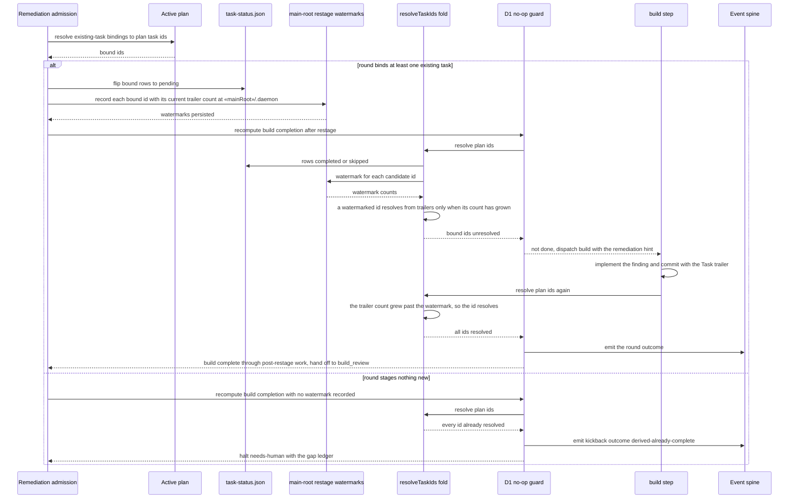

# Sequence: existing-task remediation restage survives the Task-trailer union

**Last updated:** 2026-09-06
**Scope:** One existing-task remediation round from disposition through restage, the D1 no-op
guard's completion recheck, the build re-dispatch, and the post-restage commit that legitimately
re-resolves the task. Also covers the two behaviors that must not regress: a genuinely no-op
round, and the #859 fresh-build case whose rows were never flipped.

## Diagram

## Legend

- **Restage watermark** — the number of trailered commits an id already had when an
  existing-task remediation reopened it, stored at the main repo root under `.daemon/` so it
  survives worktree recreation. Until that count grows, the trailers are pre-restage history and
  cannot resolve the task; a `Done when:` row close still can.
- **Fold** — `resolveTaskIds` in `task-progress.ts`, the single resolution definition shared by
  the build completion predicate, the D1 no-op guard, and the stall circuit breaker.
- **#859 fresh build (unchanged)** — a build whose rows were never flipped records no watermark,
  so its trailer-evidenced tasks resolve exactly as they do today and it routes to build_review
  without stalling.

## Change Log

| Date | Change | Reason |
|------|--------|--------|
| 2026-09-06 | Initial generation | Spec for #2196 restage watermark |
| 2026-09-06 | Watermark moved to main-root `.daemon/` | Conflict-check: worktree recreation erased the restage with no trace (#549 Story 6) |
