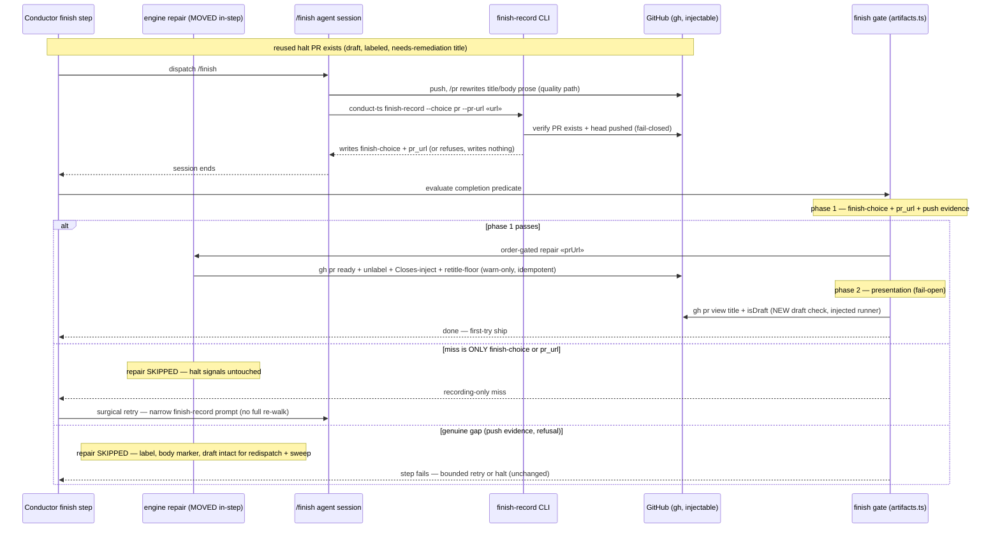

# Sequence: finish step with engine-owned presentation repair (issue #499)

**Last updated:** 2026-07-11
**Scope:** One finish attempt for a feature whose branch carries a reused
needs-remediation halt PR — the class that failed try 1 on 6 of 7 ships
(2026-07-10/11). Shows the engine repair running pre-gate, the hardened gate,
and the surgical recording-only retry.

## Diagram

## Legend

- The engine repair runs once per completion evaluation, ORDER-GATED: only after the
  non-presentation conditions (phase 1) all pass, strictly before the presentation
  checks (phase 2). A refusing or failing attempt never clears the halt-recovery
  signals (label, body marker, draft) — the redispatch arm and reconciliation sweep
  stay armed (conflict-check 2026-07-11 resolution). Idempotent and warn-only: a gh
  outage never blocks the ship.
- The agent's `finish-record` remains the only writer of `finish-choice`/`pr_url`;
  its absence is still the refusal signal (adr-2026-07-07 preserved). The surgical
  retry only fires when every other gate condition already holds.
- Halt-PR birth and the reconciliation sweep are out of frame and unchanged.
- `«»` marks variable label parts.

## Change Log

| Date | Change | Reason |
|------|--------|--------|
| 2026-07-11 | Initial generation | DECIDE phase for intake issue #499 (engineer flow) |
| 2026-07-11 | Repair order-gated into the completion evaluation; pre-dispatch pass removed | Conflict-check Finding 1 resolution (operator-approved) |
