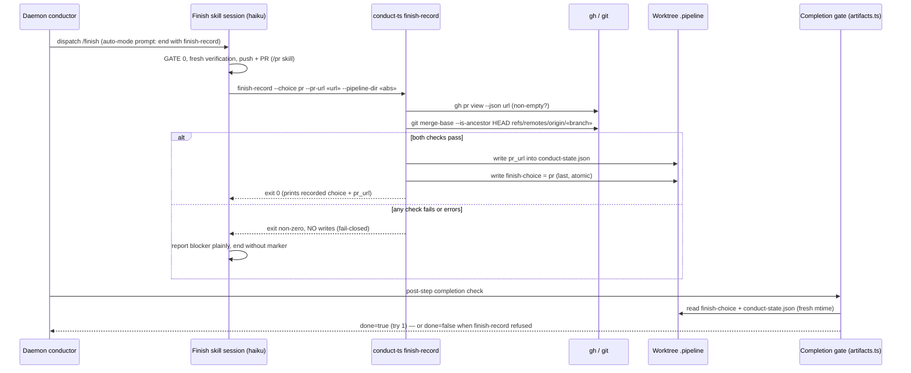

# Sequence: daemon finish step with finish-record primitive (issue #281)

**Last updated:** 2026-07-07
**Scope:** Happy path + fail-closed path of the auto-mode finish step ending with
`conduct-ts finish-record` instead of manual marker writes.

## Diagram

## Legend

- `finish-choice` is written **last**: the gate requires both the marker and `pr_url`,
  so writing the state file first means a crash between the two writes cannot produce a
  marker-present/pr_url-missing half-state that confuses the gate's error reason.
- The gate re-runs its own push-evidence and halt-title checks regardless — the
  primitive passing does not bypass any existing verification.

## Change Log

| Date | Change | Reason |
|------|--------|--------|
| 2026-07-07 | Initial generation | DECIDE phase for issue #281 (engineer flow) |
