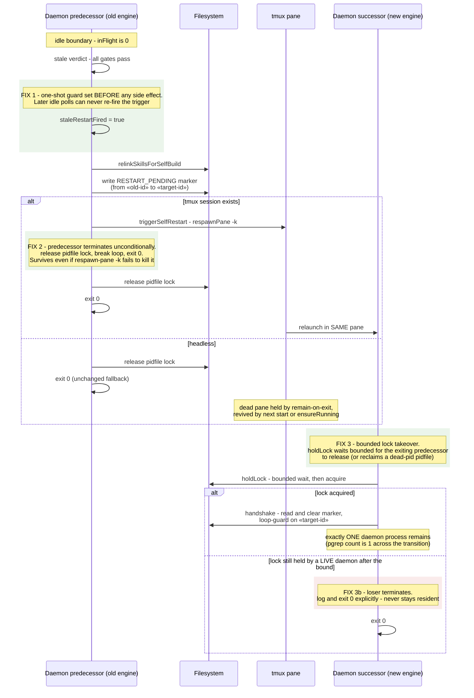

# Sequence: Single-generation stale-engine respawn (#400 fix)

**Last updated:** 2026-07-07
**Scope:** The hardened respawn-in-place flow — exactly one daemon generation survives a
stale-engine transition. Fixes the three #400 defects: multi-fire trigger, surviving
predecessor, resident lock-losers. Issue jstoup111/ai-conductor#400.

## Diagram

## Legend

- `«old-id»` / `«target-id»` are placeholder engine-identity hashes.
- Green boxes are the #400 hardening points; the red box is the hardened loser path.
- **FIX 1** closes the four-respawns-in-60s burst: the pre-fix idle branch
  (`daemon.ts:818-851`) re-fired `requestRestart` on every idle poll with no guard and no
  `break` — unlike the `RESTART-PENDING` verb path, which already guards with
  `restartTriggeredSuccessfully`.
- **FIX 2** closes predecessor survival: the pre-fix session-hosted requester
  (`daemon-cli.ts:320-331`) trusted `respawn-pane -k` to kill the process and deliberately
  skipped lock-release/exit; observed evidence (#400) shows predecessors survive. Exit is
  now unconditional after firing; ordering is trigger → release → exit so the successor's
  bounded wait (FIX 3) plus dead-pid stale reclaim covers both kill orderings.
- **FIX 3** closes resident losers: pre-fix, a successor losing `holdLock` merely
  `return`ed (`daemon-cli.ts:430-433`) and the process stayed alive in the pane. The loser
  path now ends in an explicit exit, and acquisition first waits bounded for the
  predecessor's in-flight release rather than declaring defeat instantly.
- Re-enables `auto_restart_on_stale_engine` (reverts the #402 operational disable).

## Change Log

| Date | Change | Reason |
|------|--------|--------|
| 2026-07-07 | Initial generation | DECIDE phase for issue jstoup111/ai-conductor#400 |
