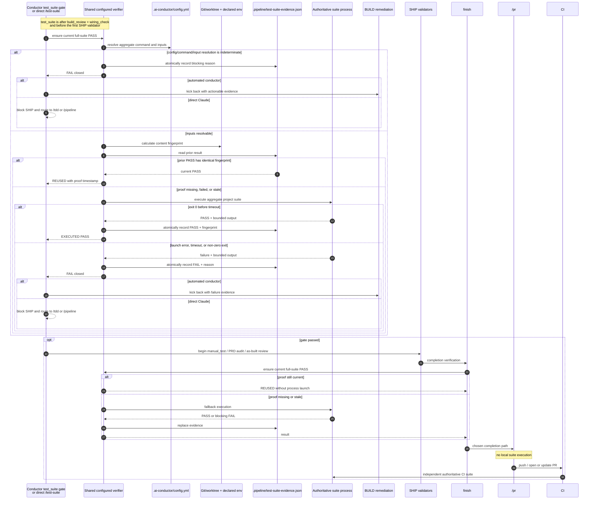

# Sequence: Shared full-suite verification and reuse (#940)

**Last updated:** 2026-07-25
**Scope:** Automated and direct-Claude entry, current-proof reuse, failure
kickback, finish fallback, and independent PR/CI behavior.

## Diagram

## Earlier full-suite fallback

When scoped-test selection is unsafe or impossible during BUILD, the workflow
uses the host's repository-configured verifier interface instead of calling the
project's aggregate command directly. A successful fallback therefore writes the same proof. At
the explicit `test_suite` gate, unchanged inputs produce `REUSED`, not a second
execution.

Ordinary TDD cycles, batch boundaries, parallel joins, and `build_review`
continue to execute only their scoped or impacted test sets.

## Invalidation behavior

- The verifier recalculates the fingerprint on every gate/CLI/finish call, so
  source, test, configuration, dependency, migration, test-infrastructure,
  declared environment, and relevant uncommitted changes become stale without
  relying solely on step state or `HEAD`.
- Documentation-only changes do not alter the fingerprint.
- A post-PASS BUILD kickback or rebase may preserve the proof only when the
  recalculated fingerprint is identical. Any indeterminate comparison forces a
  new run or blocks if the suite cannot be run.
- A resumed completed state performs the same current-proof check before it is
  accepted; stale completion metadata does not bypass verification.
- Status reporting distinguishes `EXECUTED`, `REUSED`, `STALE`, and `FAILED`
  and includes the invalidation/failure reason.

## Change Log

| Date | Change | Reason |
|------|--------|--------|
| 2026-07-25 | Initial generation | DECIDE phase for issue #940 |
| 2026-07-25 | Added completed-state resume behavior and confirmed plan Tasks 10–20 preserve the sequence | Plan-update architecture pass |
