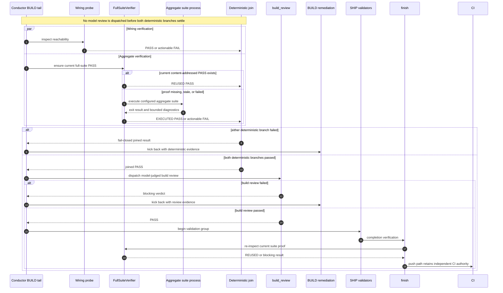

# Sequence: Deterministic BUILD verification fan-out

**Last updated:** 2026-07-29
**Scope:** Concurrent wiring and aggregate-suite verification, single-writer join, deferred model review, BUILD remediation, and proof reuse.

## Diagram

## Join contract

- Both deterministic branches are allowed to settle; neither writes conductor state directly.
- The join is the sole state, gate, and event writer for the fan-out round.
- A failed aggregate suite and a failed wiring probe retain their existing reason classifications and BUILD kickback targets.
- `build_review` is never launched on a joined deterministic failure.
- Cancellation or interruption preserves settled branch evidence and leaves incomplete branches retryable without converting absence into success.
- The aggregate suite may write ignored ephemeral outputs such as coverage data, but it does not mutate fingerprinted project inputs or wiring-probe inputs; both branches therefore observe the same completed build.

## Standalone verification

`conduct-ts test-suite` invokes `FullSuiteVerifier` directly and reports the same current, stale, executed, reused, and failed outcomes. It is a deterministic command surface, not a skill invocation.

## Change Log

| Date | Change | Reason |
|------|--------|--------|
| 2026-07-25 | Initial generation | DECIDE phase for issue #940 |
| 2026-07-25 | Added completed-state resume behavior | Issue #940 plan update |
| 2026-07-29 | Replaced the serial skill-facing flow with deterministic BUILD fan-out and deferred model review | Deterministic test-suite step specification |
