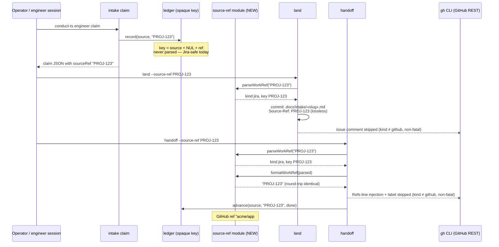

# Sequence: Jira source-ref traveling the intake → spec flow

**Last updated:** 2026-07-22
**Scope:** How a Jira ref (`PROJ-123`) flows claim → ledger → land → handoff once the
canonical tagged-ref module owns the grammar — and where GitHub-only writebacks no-op.
A GitHub ref (`owner/repo#N`) takes the identical path with the writebacks active.

## Diagram

## Legend

- `--x` arrows: writeback deliberately skipped for `kind: 'jira'` — same non-fatal
  contract as today's null→no-op for malformed refs. A later Jira adapter (issue
  #774) replaces these skips with Jira API calls without touching the grammar.
- The ledger never calls the parser: its idempotency key is the opaque ref string.

## Change Log

| Date | Change | Reason |
|------|--------|--------|
| 2026-07-22 | Initial generation | DECIDE phase for intake jstoup111/ai-conductor#847 (refs #774) |
