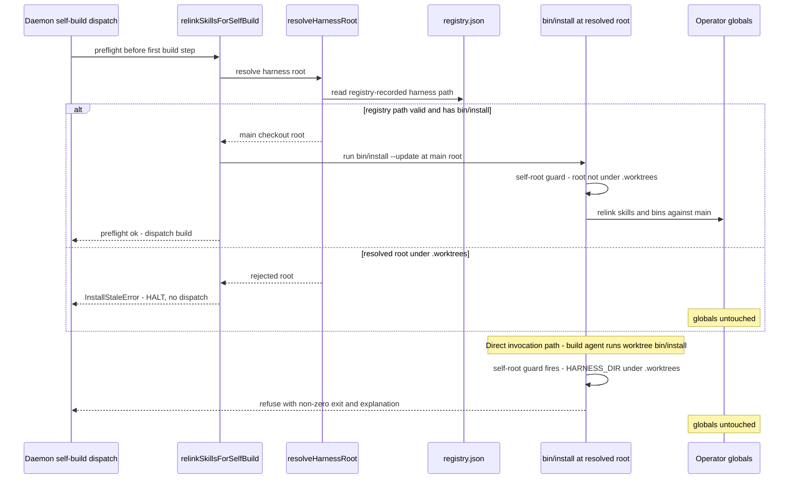

# Sequence: Self-build relink preflight with worktree-root guards (#363)

**Last updated:** 2026-07-06
**Scope:** The self-build dispatch preflight (`runSelfBuildDispatch` → `relinkSkillsForSelfBuild`)
after the fix, including both refusal branches — a worktree-resolved harness root and a direct
worktree-rooted `bin/install` invocation.

## Diagram

## Legend

- The `alt` block covers the engine-side guard (registry-first resolution with a
  `.worktrees/` hard-reject that HALTs instead of relinking).
- The trailing notes cover the installer-side guard, which is caller-independent: any
  `bin/install` whose own root sits under `.worktrees/` refuses global linking unless
  the explicit override flag is passed.

## Change Log

| Date | Change | Reason |
|------|--------|--------|
| 2026-07-06 | Initial generation | Spec for #363 worktree-install guards |
