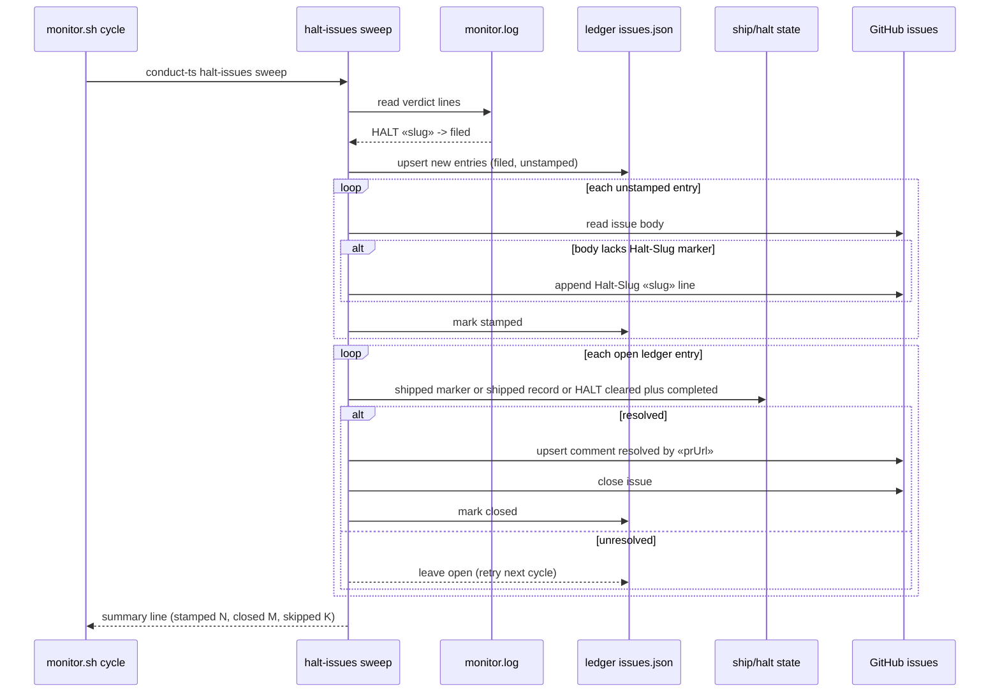

# Sequence: halt-issues sweep cycle

**Last updated:** 2026-07-08
**Scope:** One `conduct-ts halt-issues sweep` pass, invoked by the monitor loop each
cycle (and manually for backfill).

## Diagram

## Legend

- **ship/halt state** — `.daemon/processed/«slug»`, `.docs/shipped/«slug».md`, and
  `.worktrees/«slug»/.pipeline/HALT` / `HALT.cleared` in the target repo.
- Every GitHub write is idempotent (marker-tagged comment upsert; close only if open;
  stamp only if absent), so re-runs and backfills are safe.
- A GitHub or state read failure skips that entry and leaves it for the next cycle —
  the sweep never crashes the monitor loop.

## Change Log

| Date | Change | Reason |
|------|--------|--------|
| 2026-07-08 | Initial generation | DECIDE phase for issue #390 (auto-close sweep) |
