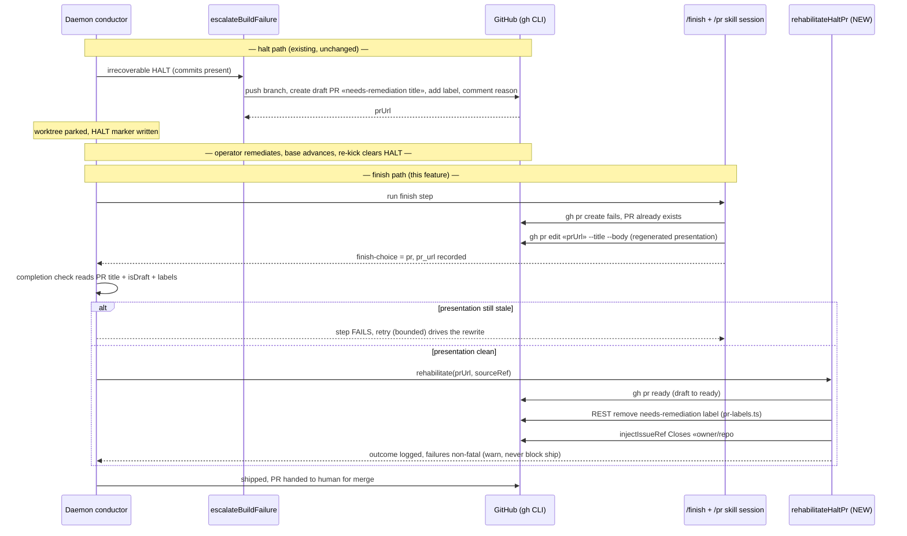

# Sequence: halt → remediate → re-kick → finish rehabilitates the reused PR

**Last updated:** 2026-07-03
**Scope:** end-to-end flow for issue #271 — a feature that halted (draft
needs-remediation PR exists), was remediated and re-kicked, and now finishes.
The resulting ready PR must be indistinguishable from a never-halted feature's PR.

## Diagram

## Legend

- The halt path is untouched — this feature only changes what happens when
  `finish` completes a feature whose PR was born as a needs-remediation draft.
- The completion check is the deterministic gate that makes the skill-side
  rewrite reliable (same pattern as existing finish-choice / shipped-record
  checks); the rehabilitation step's mechanics are best-effort and warn-only —
  a gh outage never blocks the ship (mirrors `conduct shipped-record`
  degradation semantics).
- `«»` marks variable label parts.

## Change Log

| Date | Change | Reason |
|------|--------|--------|
| 2026-07-03 | Initial generation | DECIDE phase for issue #271 (engineer session) |
