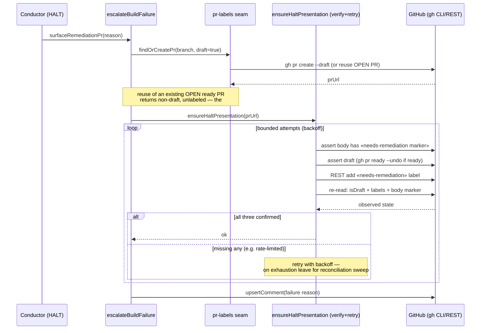
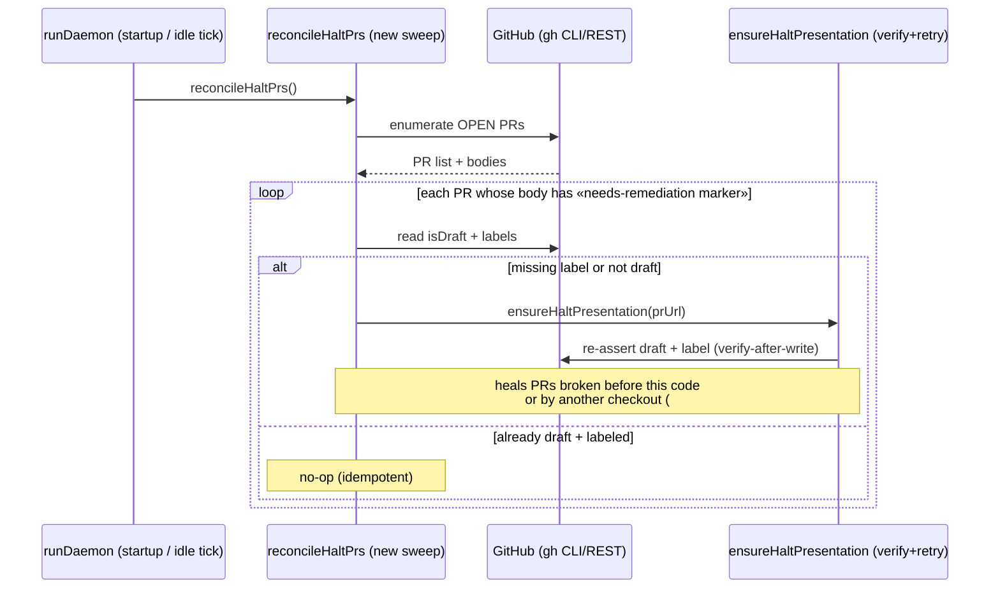

# Sequence: Halt-PR presentation reliability

**Last updated:** 2026-07-05
**Scope:** The two flows that guarantee a halt PR carries the `needs-remediation` label + draft
status: (1) escalation with verify-after-write, and (2) the reconciliation sweep that heals PRs
which slipped through. Source: ai-conductor#274.

## Diagram — Flow 1: escalation with verify-after-write

## Diagram — Flow 2: reconciliation sweep (startup + periodic tick)

## Legend

- **ensureHaltPresentation** — new verify-after-write helper: writes desired state (body marker,
  draft, label) then re-reads to confirm, retrying bounded on failure. Idempotent — safe to call
  from both escalation and the sweep.
- **«needs-remediation marker»** — `conductor:needs-remediation` HTML comment written into the PR
  **body/description** (the durable, enumerable anchor). The existing same-named *comment* marker
  is retained for the human-facing failure reason.
- **reconcileHaltPrs** — new sweep hooked into `runDaemon` startup and the idle tick; the ultimate
  safety net when inline verify-after-write is exhausted (e.g. sustained rate-limit, #270).
- **Reuse gap** — `findOrCreatePr` reusing an OPEN ready PR is the likely root cause of #268/#269;
  escalation must force draft + label + body marker on the reuse path, not only on create.

## Change Log

| Date | Change | Reason |
|------|--------|--------|
| 2026-07-05 | Initial generation | Halt-PR reliability spec (ai-conductor#274) |
