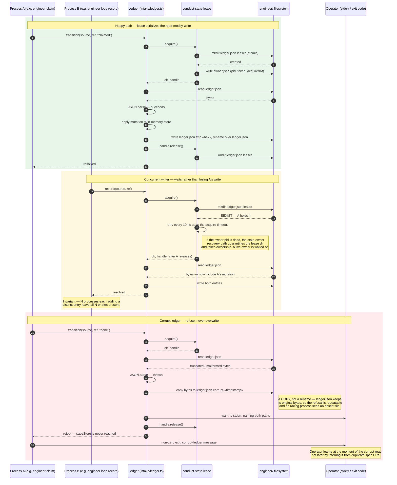

# Sequence: Intake ledger mutation under lease, and the corrupt-read refusal

**Last updated:** 2026-08-12
**Scope:** One mutating ledger operation (`record` / `transition` / `forget` / `reopen` /
`requeueClaimed`) after intake #1476, covering the three outcomes that matter: the happy
path, a second concurrent process, and an unparseable ledger.

## Diagram

## Legend

- **Green band:** the ordinary mutation. The only structural change versus today is that the
  load-mutate-save triple is bracketed by lease acquire and release.
- **Yellow band:** a second OS process attempting a mutation while the first holds the lease.
  The `mkdir` is the atomicity primitive — it either creates the directory or fails with
  `EEXIST`, with no window in between. Waiting is what makes concurrent writes additive
  instead of last-writer-wins.
- **Red band:** the corrupt read. Note that `write ledger.json` never appears in this band —
  that absence is the whole point of the change. Today this band ends with an empty store
  being written over the corrupt file.
- **`«timestamp»` / `«hex»`** are placeholders for the generated suffix values.

## Contrast with today's behavior

| Situation | Today | After #1476 |
|-----------|-------|-------------|
| File absent (first run) | Empty store, silent | Unchanged — empty store, silent |
| File unparseable | Empty store, silent, then persisted over the original | Bytes copied aside, operator warned, operation refused, original intact |
| Two processes mutating | Interleaved read-modify-write; one write is lost | Serialized by lease; both writes present |
| Lease holder crashes | n/a | Stale-owner recovery reclaims after a liveness probe |

## Change Log

| Date | Change | Reason |
|------|--------|--------|
| 2026-08-12 | Initial generation | Intake #1476 — document the mutation path, the concurrent-writer path, and the corrupt-read refusal |
