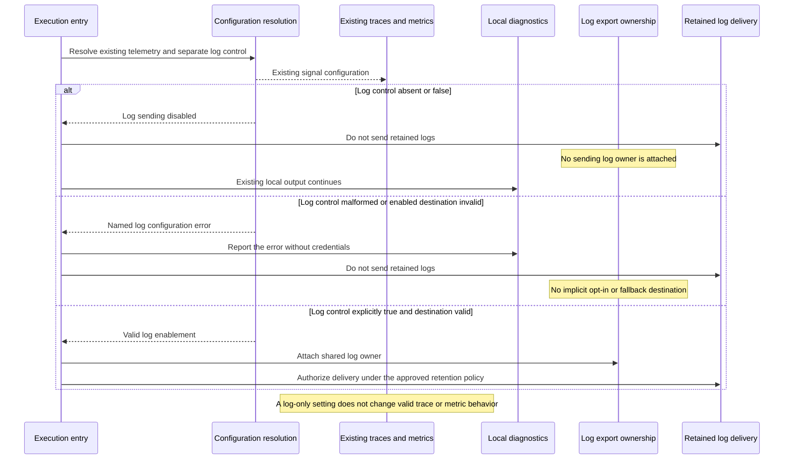

# Sequence: Independent opt-in and invalid configuration

**Last updated:** 2026-09-30
**Status:** Approved by operator in composer chat, 2026-09-30
**Scope:** Existing OTel enablement cannot enable logs, and invalid log configuration cannot disable valid traces or metrics.

## Diagram

## Legend

Enablement and validation are independent logical results; the concrete configuration shape belongs to architecture review. Disabled-log behavior includes retained batches. The architecture review must resolve how the existing shared delivery runtime enforces this rule across process ownership changes; no record is authorized merely because it exists on disk.

## Requirement Coverage

FR-1, FR-6, FR-7, and FR-10.

## Change Log

| Date | Change | Reason |
| --- | --- | --- |
| 2026-09-30 | Initial proposal | DECIDE for #1935 after operator approval of the PRD |
