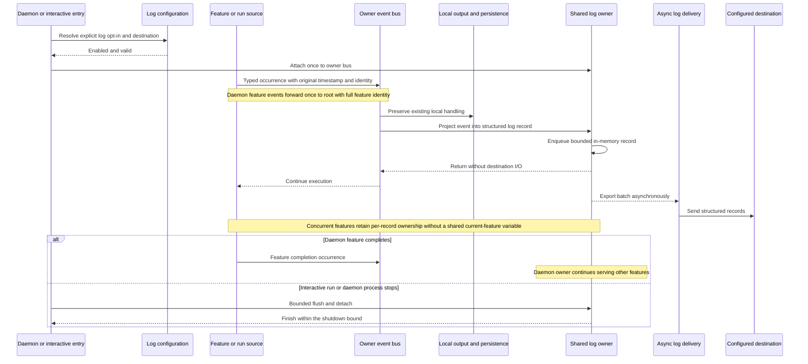

# Sequence: Enabled delivery and concurrent feature attribution

**Last updated:** 2026-09-30
**Status:** Approved by operator in composer chat, 2026-09-30
**Scope:** Normal delivery in both modes, with one owner and unchanged local output.

## Diagram

## Legend

The owner bus is the daemon root bus or the interactive run bus. The flow is shared; only lifetime and source-context wiring differ. Local handling is existing behavior and does not depend on successful remote delivery. Remote transport retries can repeat a batch; the single-owner rule prevents duplicate creation through event forwarding, not all network-level duplicates.

## Requirement Coverage

FR-2 through FR-8 and FR-11. Startup diagnostics and abrupt-exit limits will be specified by architecture review rather than implied to be lossless by this normal-flow diagram.

## Change Log

| Date | Change | Reason |
| --- | --- | --- |
| 2026-09-30 | Initial proposal | DECIDE for #1935 after operator approval of the PRD |
