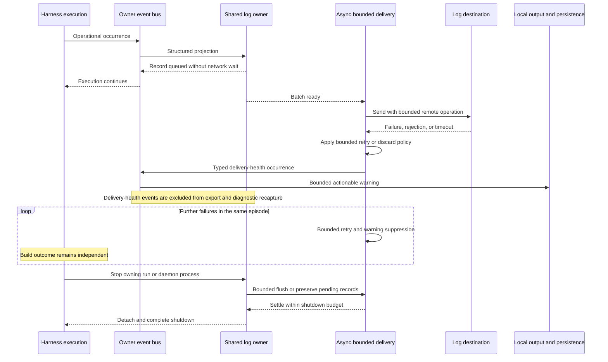

# Sequence: Delivery failure and bounded shutdown

**Last updated:** 2026-09-30
**Status:** Approved by operator in composer chat, 2026-09-30
**Scope:** Remote failure remains isolated from builds, and its diagnostics cannot feed back into log delivery.

## Diagram

## Legend

Failure classification and durable storage reuse the governing export architecture; this feature does not create a second spool. Bounds, discard reporting, oversize handling, and ownership on restart are concrete architecture-review obligations. The diagram intentionally promises bounded shutdown rather than delivery of every pending record during an outage.

## Requirement Coverage

FR-6 through FR-9 and FR-11.

## Change Log

| Date | Change | Reason |
| --- | --- | --- |
| 2026-09-30 | Initial proposal | DECIDE for #1935 after operator approval of the PRD |
