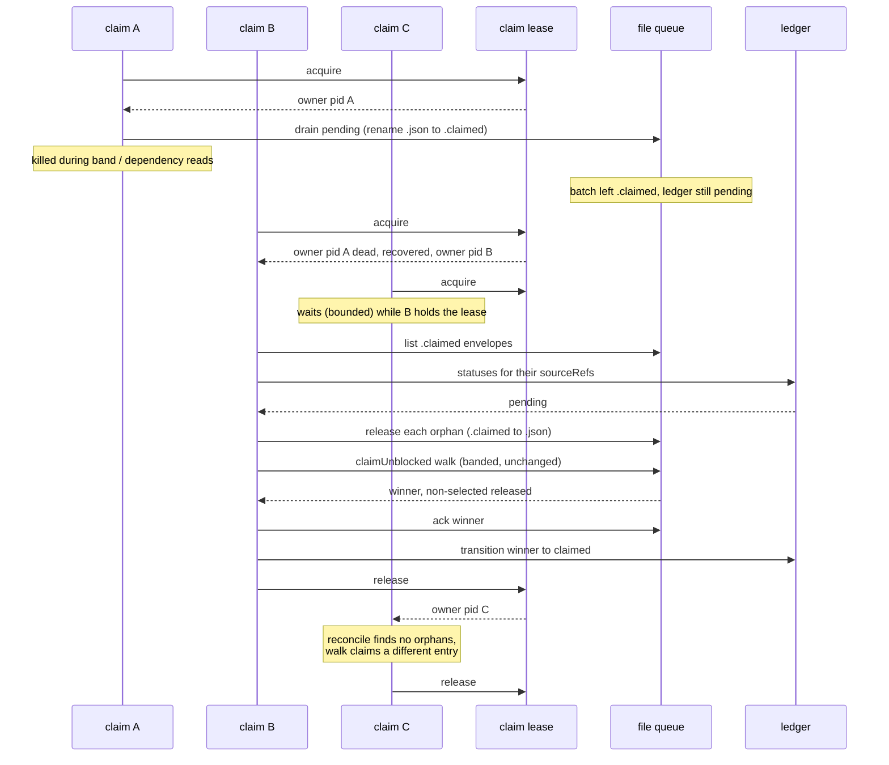

# Sequence: Lease-guarded intake claim after an interrupted claim (#2733)

**Last updated:** 2026-10-02
**Scope:** Claim A is killed mid-walk; claim B later recovers A's stranded batch, while a
concurrent claim C waits for B's lease.

## Diagram

## Legend

- Reconciliation runs only while the lease is held, so it can never touch a live walk's held
  envelopes (no double handout, compare #862).
- Strands created before this ships are recovered the same way on the first claim after upgrade.
- If C's bounded wait expires, C fails with a clear "claim in progress" error rather than racing.

## Change Log

| Date | Change | Reason |
|------|--------|--------|
| 2026-10-02 | Initial generation | DECIDE phase for issue #2733 |
