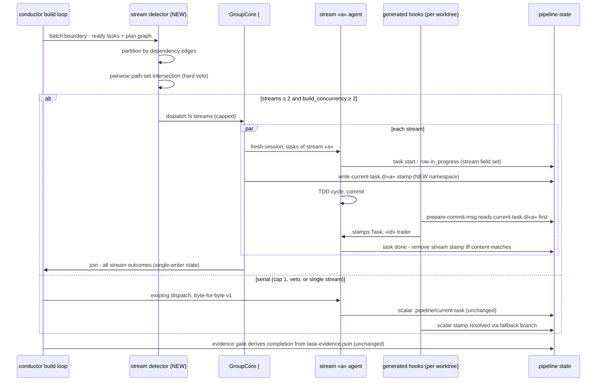

# Sequence: Parallel task-stream dispatch with dual-stamp attribution (#474 target, #552 spec-lock)

**Last updated:** 2026-07-12
**Scope:** One batch boundary in the post-v1 build loop: stream detection, GroupCore
fan-out, per-stream stamp/hook attribution, and the join. Serial mode (cap 1 or veto)
is the unchanged v1 path and is shown as the alternative.

## Diagram

## Legend

- **Stream stamp write** — the pre-dispatch session hook (engine-generated) writes the
  per-stream stamp; the post-dispatch hook removes it iff content matches, mirroring the
  scalar stamp's existing compare-and-clear semantics.
- **Hook resolution order** — stream stamp matching the committing session first, scalar
  `.pipeline/current-task` as fallback; absent both, the hook abstains (existing behavior).
- **Join** — GroupCore returns stream outcomes; only the core writes shared state
  (single-writer invariant from #469's APPROVED ADR).
- `«…»` — placeholder for a variable value.

## Change Log

| Date | Change | Reason |
|------|--------|--------|
| 2026-07-12 | Initial generation | DECIDE phase for #552 (#474 interface spec-lock) |
