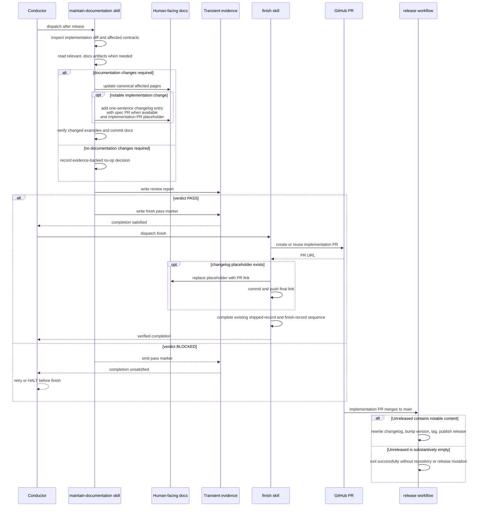

# Sequence: documentation gate and PR-link finalization

**Last updated:** 2026-07-25
**Scope:** One implementation run from post-rebase documentation review through verified finish, including no-op and blocking paths.

## Diagram

## Legend

- `.docs/` is read-only to `maintain-documentation`; the skill writes only current human-facing documentation and transient evidence.
- The pass marker is distinct from the review report so a blocked review remains inspectable without satisfying completion.
- Projects without the custom step keep the existing `rebase → finish` sequence.
- Projects without the exact changelog placeholder keep the existing finish behavior.
- A merge without notable changelog content does not create a release or bump `VERSION`.

## Change log

| Date | Change | Reason |
|------|--------|--------|
| 2026-07-25 | Initial design | Define gate ordering, negative path, and project isolation |
| 2026-07-25 | Add release trigger branch | Make empty Unreleased a successful no-release outcome |
