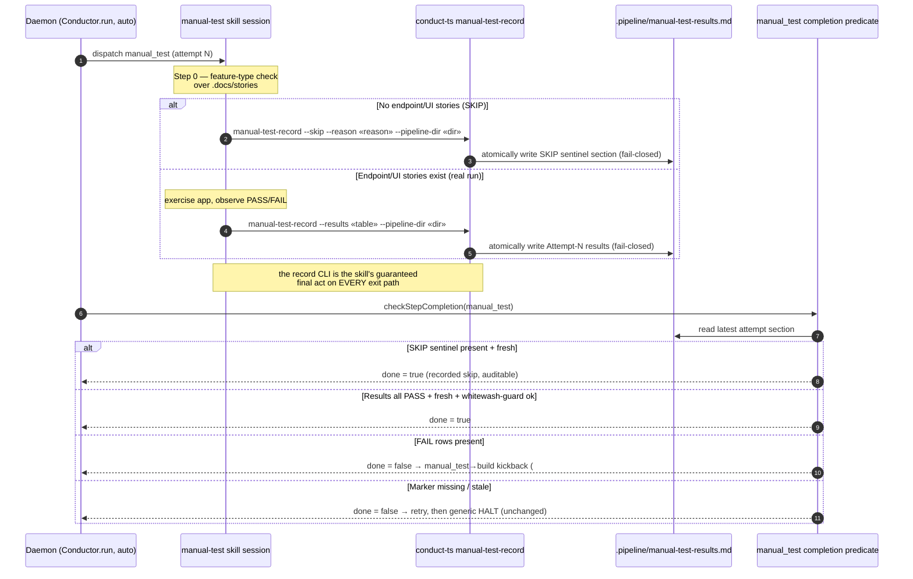

# Sequence: manual_test completion in auto/daemon mode (Approach C)

**Last updated:** 2026-07-21
**Scope:** The daemon's `manual_test` step completion path after the auto-mode marker fix
(intake #385). Shows the new `conduct-ts manual-test-record` CLI as the deterministic,
fail-closed write point for `.pipeline/manual-test-results.md`, and the SKIP-sentinel branch
that lets a no-endpoint/UI feature complete without burning retries into a HALT.

## Diagram

## Legend

- **Daemon (auto)** — `Conductor.run` in `mode === 'auto'`; unattended, no recovery menu.
- **manual-test-record** — new `conduct-ts` subcommand; sole writer of the marker in auto
  mode, atomic + fail-closed (nothing written if the write can't complete), mirroring the
  `finish-record` precedent (#281).
- **SKIP sentinel** — an explicit, recognized "skipped — no endpoint/UI stories" section the
  completion predicate accepts as `done`; the skip is *recorded and reasoned*, never a silent
  engine auto-skip (avoids the #367 whitewash hazard).
- **whitewash-guard / FAIL kickback** — existing #367 behavior; a FAIL→PASS flip still
  requires HEAD movement, and FAIL rows still route to build. Unchanged by this fix.
- `« »` guillemets mark variable label parts (renderer-safe).

## Change Log

| Date | Change | Reason |
|------|--------|--------|
| 2026-07-21 | Initial generation | DECIDE for intake #385 — Approach C manual_test auto-mode marker record |
