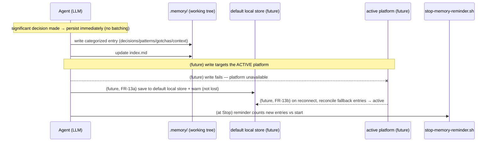

# Sequence: Memory Recall & Persist — Current State

**Last updated:** 2026-06-29
**Scope:** Today's recall (session start) and persist (during work) flows for the harness
`/memory` system. Baseline for the Pluggable Memory feature — the **future** flows must keep
these behavior-identical for the default platform (FR-9/FR-10) and add platform resolution
(FR-1/FR-2), agent-queryable non-default platforms (FR-3/FR-4), and write-fallback +
reconcile (FR-13a/FR-13b). The fallback/reconcile and resolution arrows are marked `(future)`.

## Recall (session start)

```mermaid
sequenceDiagram
    participant CC as Claude Code (session start)
    participant Hook as session-start-context.sh
    participant Agent as Agent (LLM)
    participant Store as .memory/ (working tree)

    CC->>Hook: SessionStart
    Hook->>Store: read .memory/index.md (head -20), count entries
    Hook-->>Agent: inject index summary into context
    Note over Agent: /memory Recall Protocol (hard gate)
    Agent->>Store: read index.md
    Agent->>Store: read relevant entries in full (agent judges relevance)
    Agent->>Agent: staleness check (>30d / referenced files moved)
    Agent-->>CC: surface "Recalled: …" / "Stale: …"
    Note right of Store: (future) resolve active platform first;<br/>if non-default, agent queries it (e.g. MCP) instead of .memory/
```

## Persist (during work)



## Notes for architecture-review

- **Invariant to preserve (FR-3):** every arrow into a store from the Agent is the agent
  reading/judging — there is no harness-side search node, and none may be added.
- **Default = today (FR-9):** the recall flow above is unchanged for the default platform; only
  the **store location** moves (FR-5) to make it durable/shared.
- **Resolution seam (FR-1/FR-2):** a platform-resolve step precedes both flows; unknown/unavailable
  → fall back to default, never block (FR-13).
- **Two stores in the failure path (FR-13a/b):** the default local store doubles as the
  write-fallback sink; reconcile is one-directional (fallback → active) on reconnect.

## Change Log

| Date | Change | Reason |
|------|--------|--------|
| 2026-06-29 | Initial generation | Baseline recall/persist flows for the Pluggable Memory architecture-review |
