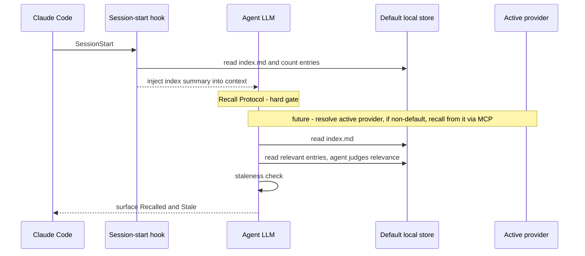
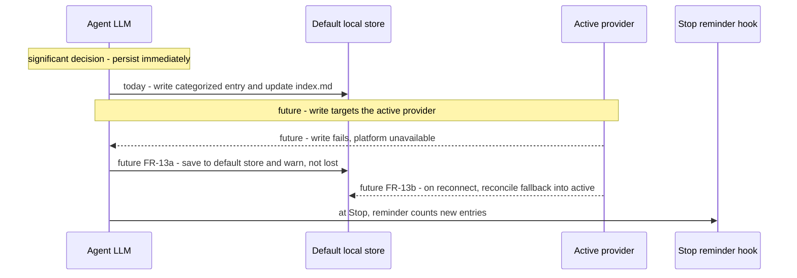

# Sequence: Memory Recall & Persist — Current State

**Last updated:** 2026-06-29
**Scope:** Today's recall (session start) and persist (during work) flows for the harness
`/memory` system. Baseline for the Pluggable Memory feature — the **future** flows must keep
these behavior-identical for the default provider (FR-9/FR-10) and add provider resolution
(FR-1/FR-2), agent-queried non-default providers (FR-3/FR-4), and write-fallback +
reconcile (FR-13a/FR-13b). Steps that are not in today's flow are prefixed `future:`.

## Recall (session start)

## Persist (during work)

## Notes for architecture-review

- **Invariant to preserve (FR-3):** every read from a store is the agent reading and judging —
  there is no harness-side search node, and none may be added.
- **Default = today (FR-9):** the recall flow is unchanged for the default provider; only the
  **store location** moves (FR-5) to make it durable/shared.
- **Resolution seam (FR-1/FR-2):** a provider-resolve step precedes both flows; unknown/unavailable
  resolves to the default, never blocking (FR-13).
- **Two stores in the failure path (FR-13a/b):** the default local store doubles as the
  write-fallback sink; reconcile is one-directional (fallback into active) on reconnect.

## Change Log

| Date | Change | Reason |
|------|--------|--------|
| 2026-06-29 | Initial generation | Baseline recall/persist flows for the Pluggable Memory architecture-review |
| 2026-06-29 | Rewrote Mermaid with conservative syntax | Diagrams were not rendering on GitHub (parenthesized aliases, `--x` arrow, unicode arrows/em-dashes) |
