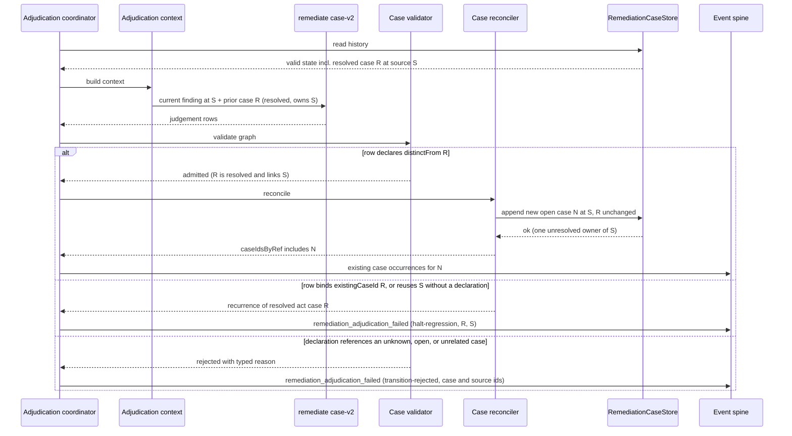

# Sequence: new concern at a source owned by a resolved case

**Last updated:** 2026-10-02
**Scope:** One build_review adjudication lap for jstoup111/ai-conductor#2464, covering the declared
new case, the undeclared recurrence, and a rejected transition.

## Diagram

## Change Log

| Date | Change | Reason |
|------|--------|--------|
| 2026-10-02 | Initial generation | jstoup111/ai-conductor#2464 DECIDE |
