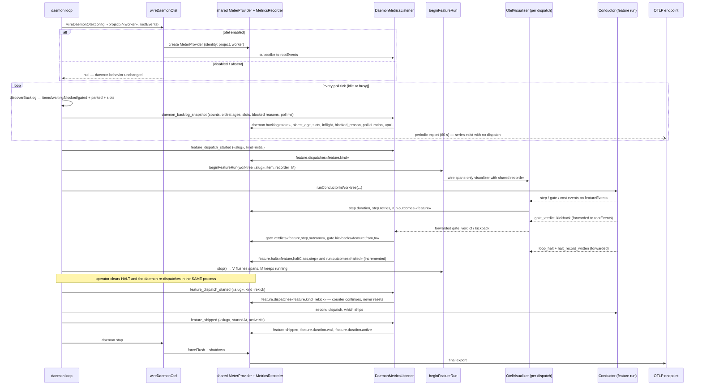

# Sequence: Daemon lifetime with a shared meter and daemon-level metrics

**Last updated:** 2026-09-06
**Scope:** One daemon process from start to stop — idle ticks emitting backlog gauges with no
dispatch, a feature dispatch recording onto the shared meter, a halt, a re-dispatch, and a ship.
Source: #1937.

## Diagram

## Legend

- The idle loop is the point of the feature: backlog, slots, and `daemon.up` series exist while
  nothing is dispatched.
- The re-dispatch after a halt lands on the **same** `MetricsRecorder`, so per-feature counters
  (`run.outcomes`, `feature.halts`, `feature.dispatches`) accumulate instead of restarting at zero.
- A daemon restart still resets counters — that is ordinary Prometheus counter semantics handled
  by `increase()`/`rate()`; the defect being fixed is a reset on every dispatch.

## Change Log

| Date | Change | Reason |
|------|--------|--------|
| 2026-09-06 | Initial generation | DECIDE for #1937 |
