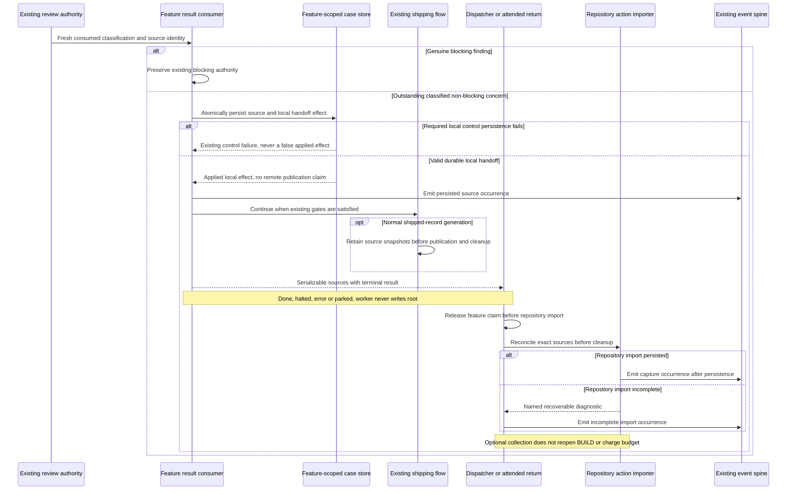

# Sequence: Capture a finding and continue shipping

**Last updated:** 2026-09-30
**Scope:** Tasks 4–12: consumed source, local handoff, terminal collection and cleanup.
**Validation:** Logical flows and plan updates approved by the operator 2026-09-30.

## Diagram

## Legend

Required local control persistence remains an existing gate requirement. A valid non-blocking
handoff is locally complete without remote intake. An outer repository import failure cannot
retroactively turn it into mandatory remediation. Shipped source snapshots preserve later recovery
when terminal collection was interrupted; all available terminal sources are collected before normal
cleanup. A telemetry failure is reported separately from a successfully persisted state transition.

[System context and flow index](../non-blocking-review-findings-have-no-post-ship-cha.md)

## Change Log

| Date | Change | Reason |
|------|--------|--------|
| 2026-09-30 | Initial capture flow | PRD FR-1, FR-3, FR-5, FR-8, FR-12 |
| 2026-09-30 | Separate required local effect from optional root collection | Plan update; approved ADR |
