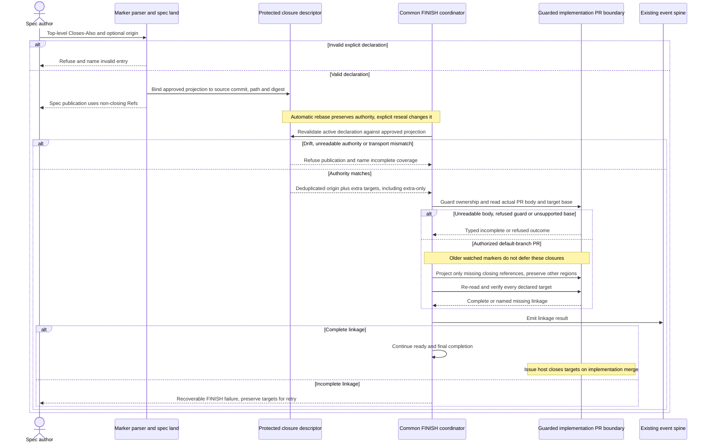

# Sequence: Close explicitly declared related issues on implementation merge

**Last updated:** 2026-09-30
**Scope:** Tasks 27–39: sealed declarations and shared FINISH verification.
**Validation:** Logical flows and plan updates approved by the operator 2026-09-30.

## Diagram

## Legend

Targets are explicit declarations, not inferred from tracker prose. Armor and fenced content cannot
supply a declaration. The sealed projection excludes mutable owner/outcome fields. Extra-only specs
work without an originating issue. Legacy origin-only behavior remains valid.

Draft creation, body refresh and common FINISH share the same projection; FINISH re-observes remote
state before and after mutation. Fully qualified cross-repository targets are distinct. Existing
matching closing references are reused without duplicate lines. Partial retry repairs missing linkage
without a broad BUILD repair. Independent observed-close watches are outside this operation.

No direct issue-close call, issue-assignee mutation or automatic merge is introduced. The issue host
applies closing keywords when the implementation PR merges into its default branch.

[System context and flow index](../non-blocking-review-findings-have-no-post-ship-cha.md)

## Change Log

| Date | Change | Reason |
|------|--------|--------|
| 2026-09-30 | Initial additional issue closure flow | PRD FR-13 through FR-16 |
| 2026-09-30 | Make merge-closure precedence explicit | Operator-approved conflict resolution |
| 2026-09-30 | Bind closure targets to the seal and shared FINISH completion | Plan update; approved ADR |
