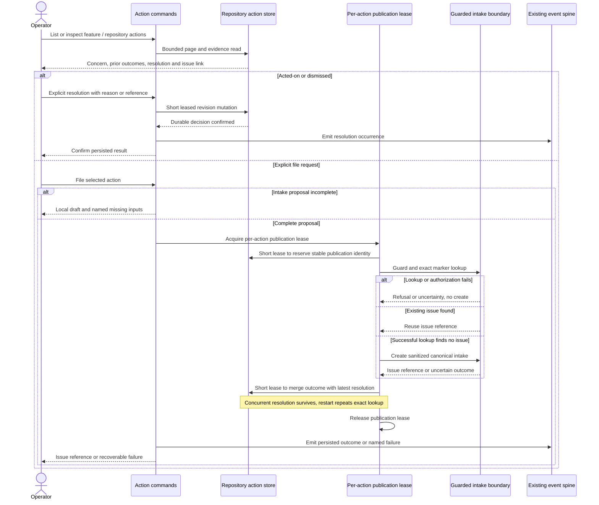

# Sequence: Resolve an action or request intake

**Last updated:** 2026-09-30
**Scope:** Tasks 13–16 and 20–23: offline decisions and serialized optional publication.
**Validation:** Logical flows and plan updates approved by the operator 2026-09-30.

## Diagram

## Legend

Local viewing and resolution never contact the tracker. Publication and resolution are independent:
filing does not mark an action acted-on, and a concurrent resolution is preserved on publication
confirmation. The per-action lease spans remote work; the feature-state lease does not. Failed
lookup cannot authorize creation. A retry after remote creation finds the stable marker before any
new create. Success is reported only after persistence; a separate telemetry diagnostic cannot
falsify or roll back a persisted decision.

[System context and flow index](../non-blocking-review-findings-have-no-post-ship-cha.md)

## Change Log

| Date | Change | Reason |
|------|--------|--------|
| 2026-09-30 | Initial resolution and publication flow | PRD FR-2 through FR-8 and FR-12 |
| 2026-09-30 | Show explicit proposal validation and publication concurrency | Plan update; approved ADR |
