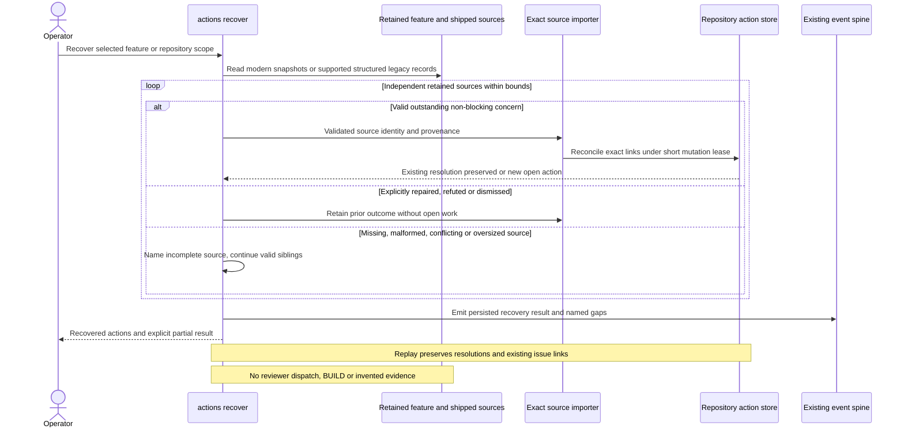

# Sequence: Recover historical actions

**Last updated:** 2026-09-30
**Scope:** Tasks 17–19: retained modern snapshots and exact supported legacy evidence.
**Validation:** Logical flows and plan updates approved by the operator 2026-09-30.

## Diagram

## Legend

Risk acceptance permits shipping but does not prove follow-up completion. Modern snapshots carry
source identity; legacy recovery uses only the approved typed/structured parsers and digest namespace,
never fuzzy prose matching. An older source cannot overwrite a later operator decision.

Recovery bounds are 8,000 bytes per source, 64 references, 512 source links and a 16 MiB repository
action envelope. A limit yields a named partial/refused result, never silent truncation or complete
empty success. These limits do not constrain existing live gate-control state.

[System context and flow index](../non-blocking-review-findings-have-no-post-ship-cha.md)

## Change Log

| Date | Change | Reason |
|------|--------|--------|
| 2026-09-30 | Initial historical recovery flow | PRD FR-5 and FR-9 through FR-12 |
| 2026-09-30 | Bind recovery to exact parsers, partial results and approved bounds | Plan update; approved ADR |
