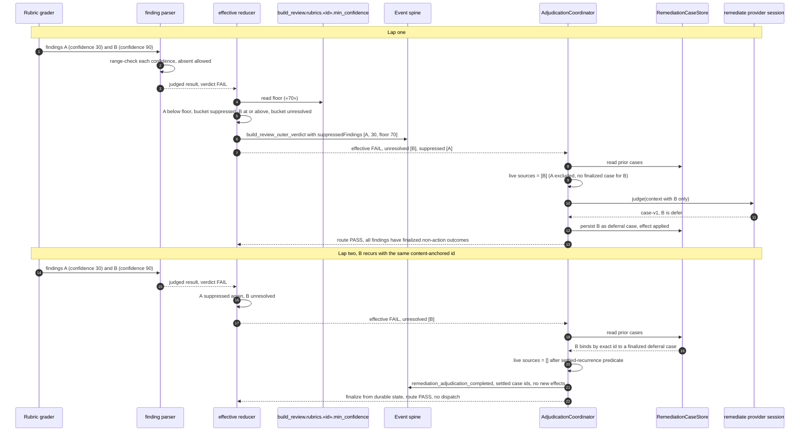

# Sequence: a sub-floor finding is suppressed and a settled finding skips the judge

**Last updated:** 2026-09-06
**Scope:** Two consecutive build_review laps for one feature. Lap one shows a sub-floor finding
suppressed at the effective verdict and a surviving finding adjudicated and deferred. Lap two shows
the deferred finding recurring by exact id and finalizing without a remediate dispatch. Companion to
`.docs/architecture/operator-configurable-confidence-floor-for-acting-.md`.

## Diagram

## Legend

- **Steps 1-7 are the suppression path.** A is dropped from the blocking set before build_review
  fails on it and never reaches the coordinator; it is visible on the spine at step 6.
- **Steps 8-13 are today's adjudication**, reduced to the surviving finding only.
- **Steps 14-21 are the settled-recurrence fast-path.** The store already links B's exact id to a
  finalized deferral, so the predicate empties the live set and the lap finalizes without paying a
  provider session. The skipped dispatch is recorded at step 20 as a completed adjudication.
- **Had B's id drifted at step 14**, it would not bind, the live set would be [B], and the judge
  would run — that is the intended boundary of the predicate.
- **Had A carried no confidence**, it would sit in unresolved and block like any other finding.

## Change Log

| Date | Change | Reason |
|------|--------|--------|
| 2026-09-06 | Initial generation | Authored during DECIDE for jstoup111/ai-conductor#2383 |
| 2026-09-06 | Rewritten for grader-side confidence and the settled-recurrence predicate | Operator revised the placement |
