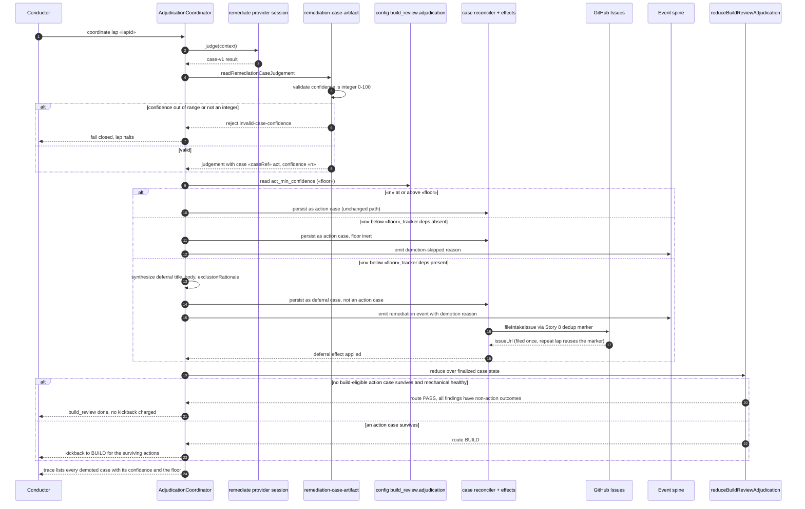

# Sequence: sub-floor action demoted to a filed deferral

**Last updated:** 2026-09-06
**Scope:** One build_review lap in which the adjudicator returns an `act` case whose confidence is
below `build_review.adjudication.act_min_confidence`. Covers the demotion, the single filing, the
spine record, and the resulting route. Companion to
`.docs/architecture/operator-configurable-confidence-floor-for-acting-.md`.

## Diagram

## Legend

- **Steps 1-9 are unchanged** from the #2087 adjudication flow apart from the range check the
  artifact reader now performs on `confidence`.
- **The three-way alt is the whole feature.** At or above the floor nothing changes; below the
  floor with no tracker the floor is deliberately inert so a lap can never be halted by a deferral
  that cannot finalize; below the floor with a tracker the case becomes a deferral before it is
  persisted.
- **A demoted case charges no kickback and dispatches no BUILD work**, because it never becomes a
  build-eligible action case in the reducer's view.
- **Nothing is silently dropped.** Every demotion is visible three ways: the filed deferral issue,
  the spine event carrying the demotion reason, and the per-lap adjudication trace that reaches
  kickback and HALT evidence.
- **«floor»** is `build_review.adjudication.act_min_confidence`, default `0`, at which the
  comparison never fires and behavior is identical to today.

## Change Log

| Date | Change | Reason |
|------|--------|--------|
| 2026-09-06 | Initial generation | Authored during DECIDE for jstoup111/ai-conductor#2383 |
