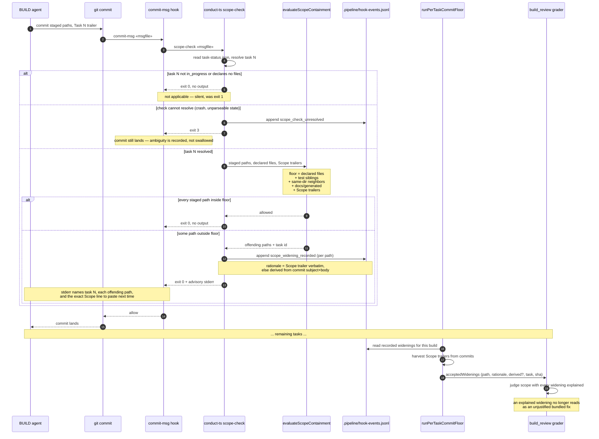

# Sequence: A BUILD commit touching a path outside its task's declared scope

**Last updated:** 2026-08-09
**Scope:** the `git commit` → `commit-msg` hook → `scope-check` → ledger → `build_review` flow,
covering the three outcomes (inside floor / outside floor / check unresolvable).

## Diagram

## Legend

- **«msgfile»** — the commit-message file path git passes to the hook.
- **exit 3** is new. Today every non-0/non-2 exit hits the hook's
  `abstained (exit N); allowing commit` branch and leaves no durable trace; splitting
  not-applicable (0) from unresolvable (3) is what makes desired outcome 4 satisfiable.
- **No refusal edge exists.** By operator direction the commit lands on every path; the gate
  remains `build_review`, now supplied with a rationale for every out-of-floor path.
- `derived?` distinguishes a verbatim `Scope:` trailer from a rationale inferred from the commit
  message, so the grader can weigh them differently.

## Change Log

| Date | Change | Reason |
|------|--------|--------|
| 2026-08-09 | Initial authoring | DECIDE for intake #1390 |
