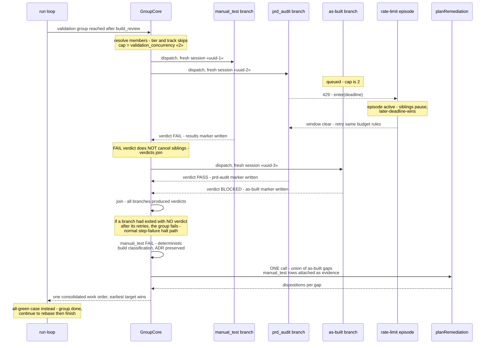

# Sequence: SHIP-tail validation fan-out, join, and consolidated kickback (#469)

**Last updated:** 2026-07-10
**Scope:** One daemon dispatch reaching the validation group after `build_review` —
capped concurrent branches, a rate-limit episode mid-flight, one FAIL verdict, and
the single consolidated remediation work order.

## Diagram

## Legend

- **Cap** — only `validation_concurrency` (default 2) branches run at once; the third
  member queues until a slot frees.
- **Rate-limit episode** — the existing per-process coordinator; a 429 in any branch
  enters the shared episode so concurrent branches wait for the same window instead
  of independently burning retries.
- **Join policy** — verdicts join, infra fails fast (operator-locked 2026-07-10).
- `«…»` — placeholder for a variable value.

## Change Log

| Date | Change | Reason |
|------|--------|--------|
| 2026-07-10 | Initial generation | DECIDE phase for #469 spec |
