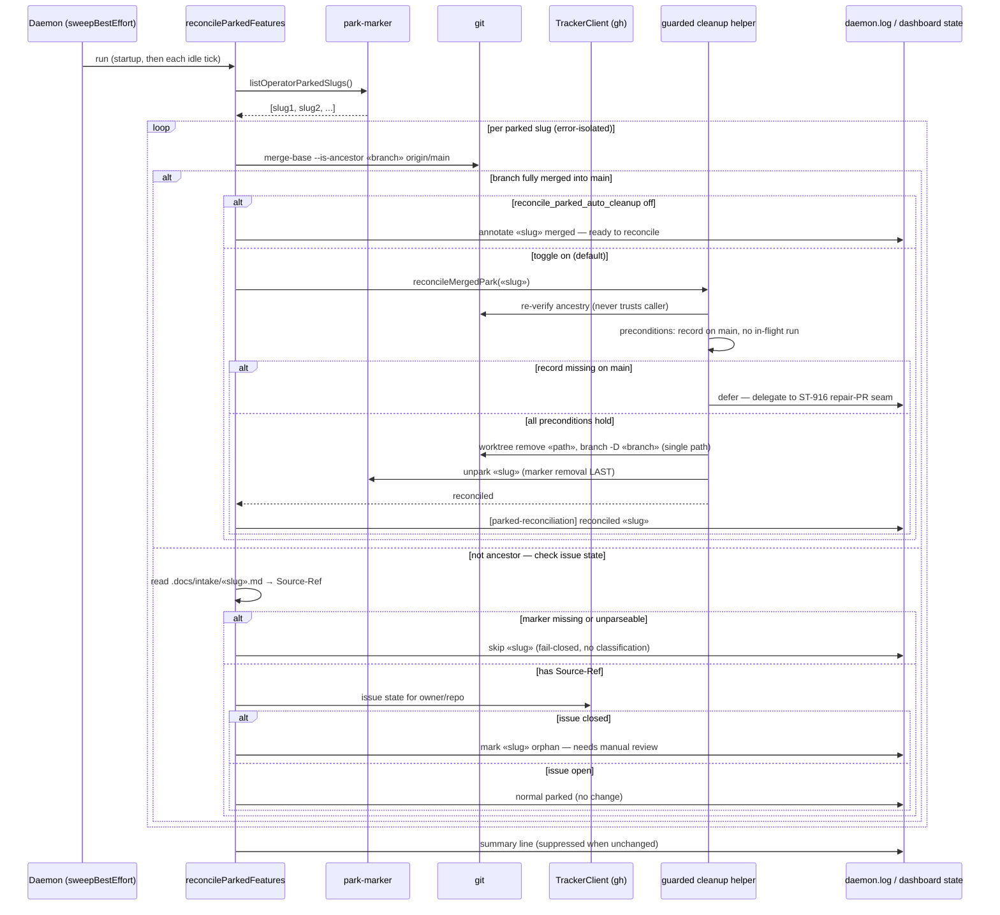

# Sequence: Parked-Feature Reconciliation Pass (#1060)

**Last updated:** 2026-07-27
**Scope:** One sweep pass over all parked slugs, showing the merged, orphan, and fail-closed outcomes.

## Diagram

## Legend

- Per-slug failures are caught and logged; one bad slug never aborts the pass (halt-pr-reconciliation pattern).
- The ancestry check is the ONLY signal that authorizes deletion; issue state alone never deletes anything.
- The summary and per-slug lines use the injected outcome cache so repeated idle ticks stay quiet when nothing changed.

## Change Log

| Date | Change | Reason |
|------|--------|--------|
| 2026-07-27 | Initial generation | DECIDE for #1060 |
