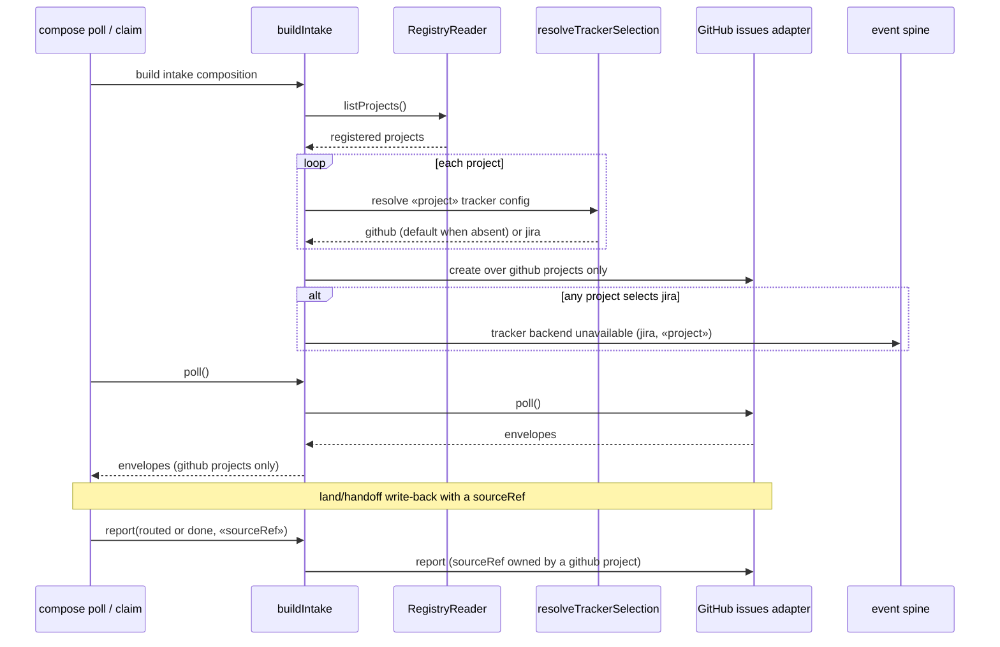

# Sequence: Intake Poll with Per-Project Tracker Selection (#845)

**Last updated:** 2026-09-28
**Scope:** How `buildIntake()` picks each registered project's tracker backend during a poll, and
how a land/handoff write-back reaches the owning backend.

## Diagram

## Legend

- `«project»` and `«sourceRef»` are placeholders.
- When every project resolves to `github`, the composite hands the whole registry to one GitHub
  adapter, so its behavior matches today's unconditional construction.

## Change Log

| Date | Change | Reason |
|------|--------|--------|
| 2026-09-28 | Initial generation | #845 DECIDE |
