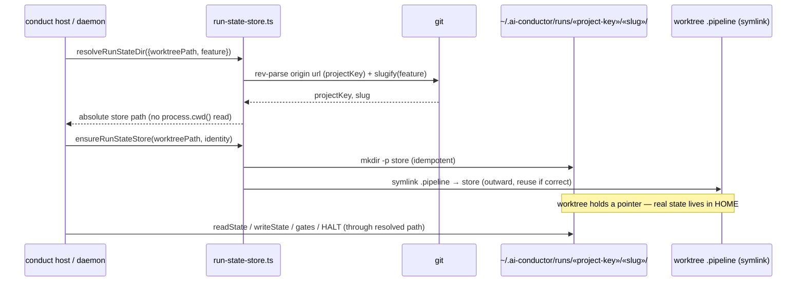
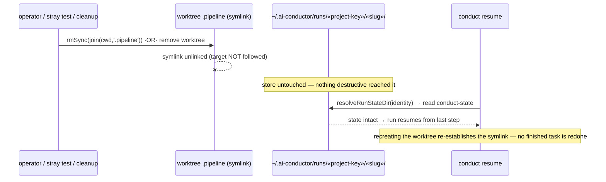
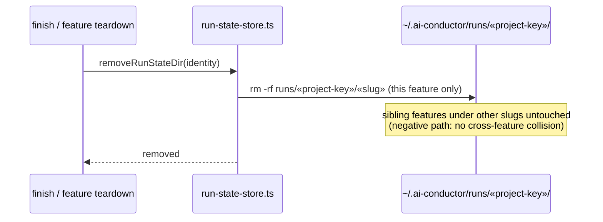

# Sequence: Run-state resolution, durability, and cleanup (#564)

**Last updated:** 2026-07-21
**Scope:** How a run resolves its state directory by feature identity (never cwd), how
the outward symlink is established, how the store survives worktree removal and a
cwd-relative `rm`, and how end-of-feature cleanup removes exactly one feature's state.

## Sequence 1 — resolve + ensure store on run start (host or daemon)

## Sequence 2 — durability under worktree removal and cwd-relative rm

## Sequence 3 — end-of-feature cleanup (scoped to one slug)

## Legend

- `«slug»` / `«project-key»` are guillemet placeholders for variable path parts.
- Sequence 1 shows the load-bearing invariant: the store path is derived from **feature
  identity** (projectKey + slug), never from `process.cwd()`.
- Sequence 2 shows the durability contract — a delete reaches only the symlink; the real
  store is off the worktree tree, so the run always resumes. This is the observable
  acceptance signal in the desired outcome ("remove the worktree… confirm the run can
  still resume").
- Sequence 3 shows cleanup is per-slug: legitimate end-of-feature removal takes exactly
  that feature's state and nothing else.

## Change Log

| Date | Change | Reason |
|------|--------|--------|
| 2026-07-21 | Initial generation | DECIDE for #564 — run-state resolution/durability/cleanup flows |
