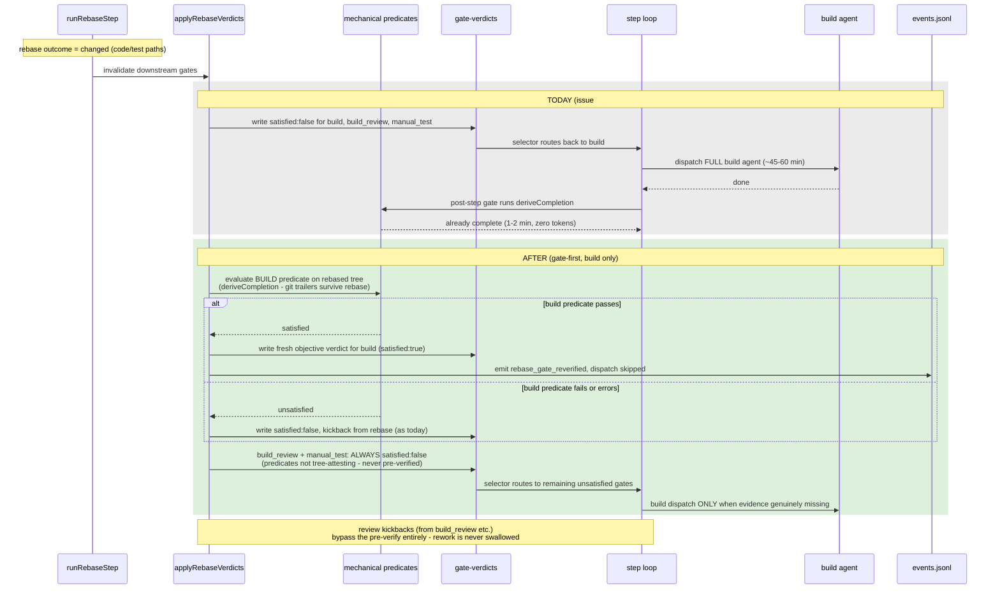

# Sequence: Post-rebase gate-first re-verify (#420)

**Last updated:** 2026-07-08
**Scope:** The invalidation-triggered re-entry lap after a file-changing finish-time rebase —
before (today) vs after (this feature).

## Diagram

## Legend

- Grey block: current behavior encoded by `test/integration/rebase-loop.test.ts` (`buildRuns`
  expected 2). Green block: target behavior — the same mechanical check, moved before dispatch.
- Only `build` is pre-verified: its predicate re-derives from git evidence (tree-attesting).
  `manual_test`/`build_review` predicates check session-freshness/presence only — a
  same-session pre-rebase artifact would falsely pass — so they stay invalidated as today.

## Change Log

| Date | Change | Reason |
|------|--------|--------|
| 2026-07-08 | Initial generation | DECIDE phase for issue jstoup111/ai-conductor#420 |
| 2026-07-08 | Narrowed pre-verify to build only | Architecture review: manual_test/build_review predicates are not tree-attesting (false-pass risk) |
