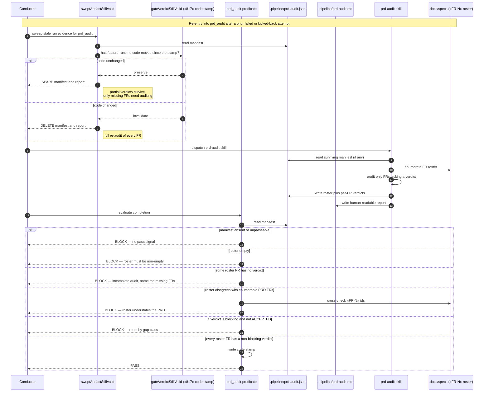

# Sequence: prd_audit coverage-complete gate

**Last updated:** 2026-08-09
**Scope:** How the `prd_audit` SHIP gate decides pass / block / re-audit once the structured
audit manifest (`.pipeline/prd-audit.json`) is the pass signal, and how a partial audit is
resumed rather than discarded. Covers the four predicate read sites that today score a partial
report as clean.

## Diagram

## Legend

- **`sweptArtifactStillValid`** (`artifacts.ts:681`) — decides whether stale run evidence is
  deleted before a re-run. This is the seam that makes partial resume possible: it already
  consults the `#817` code stamp, so "spare the partial audit" and "force a full re-audit" fall
  out of an existing question rather than new invalidation machinery.
- **`gateVerdictStillValid`** (`gate-code-validity.ts`) — answers whether the gate's
  `feature-runtime` surface has moved since the stamped verdict was formed.
- **Manifest vs report** — `.pipeline/prd-audit.json` is the machine-read pass signal;
  `.pipeline/prd-audit.md` remains the human-readable view. Both are gitignored run evidence,
  not committed design artifacts.
- **Cross-check** — applied only where the PRD carries literal `FR-N` ids (43 of 48
  non-`SUPERSEDED-` specs as of 2026-08-09). Where it cannot be applied, the manifest's own
  completeness requirement still holds, so the gate never silently degrades to fail-open.
- **Blocking verdict** — unchanged semantics: any verdict other than `ALIGNED` that is not a
  human-`ACCEPTED` divergence, routed by gap class (`impl-gap` to BUILD, otherwise HALT).

The two remaining predicate read sites not drawn above — the gate-code-validity preserve
pre-check (`artifacts.ts:2257`) and the daemon's kickback classifier
(`classifyPrdAuditGaps:3267`) — apply the same completeness question as the main path. All four
sites must share one predicate; a site left reading only for blocking rows keeps the fail-open
path alive.

## Change Log

| Date | Change | Reason |
|------|--------|--------|
| 2026-08-09 | Initial generation | New gate decision flow for the coverage-complete `prd_audit` manifest (scoped stopgap for #1398) |
