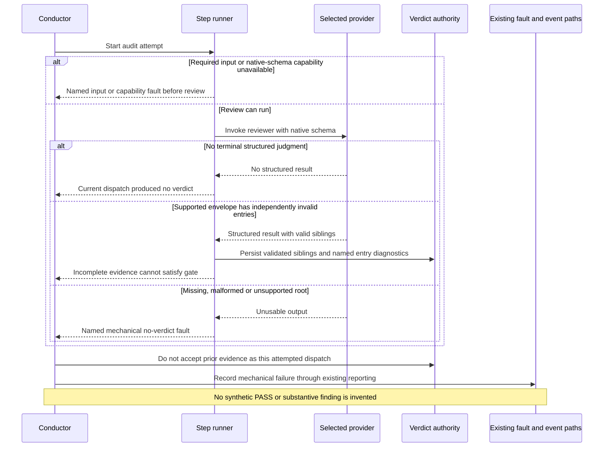

# Sequence: a dispatch does not produce a usable PRD verdict

**Last updated:** 2026-09-30
**Scope:** Missing result, malformed judgment, invalid reference, or unavailable required input.

## Diagram

## Legend

Detailed retry classification remains governed by the existing provider and step-fault policies;
the approved architecture and plan specify their mapping. Authentication, rate limits and unavailable models
retain their established handling. Error reporting names the missing current-dispatch result
instead of suggesting an old report merely needs a timestamp update. The carried #2875 outcome
also requires the already-typed as-built path to make that distinction where needed.

See the [component diagram](../prd-audit-receives-bounded-inputs-and-returns-vali.md).

## Change Log

| Date | Change | Reason |
|------|--------|--------|
| 2026-09-30 | Initial sequence | Preserve #2875 missing-verdict diagnostics |
| 2026-09-30 | Plan update: separate unusable root from incomplete entries | Tasks 8–12 persist valid siblings and keep defects blocking |
