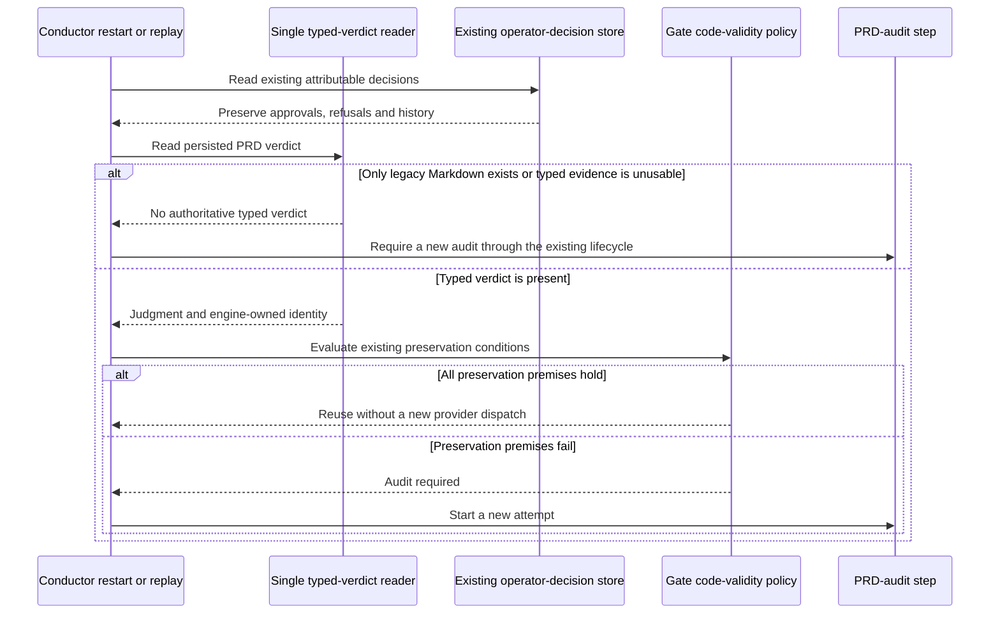

# Sequence: restart and legacy PRD report handling

**Last updated:** 2026-09-30
**Scope:** Proposed compatibility behavior following the shipped as-built migration pattern.

## Diagram

## Legend

Migration does not reinterpret a historical Markdown report as a typed verdict or discard
durable operator decisions. Legacy decision-import behavior remains with its existing owner.
The exact preservation premises and compatibility transition will be reviewed against the
governing ADRs before stories are accepted.

See the [component diagram](../prd-audit-receives-bounded-inputs-and-returns-vali.md).

## Change Log

| Date | Change | Reason |
|------|--------|--------|
| 2026-09-30 | Initial sequence | Make restart and legacy evidence boundaries reviewable |
