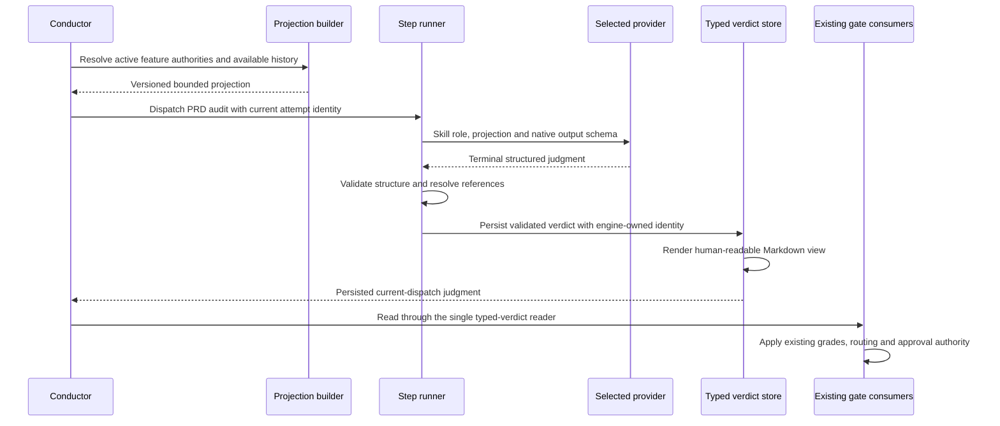

# Sequence: successful PRD-audit dispatch

**Last updated:** 2026-09-30
**Scope:** Both supported providers through the existing provider-aware step runner.

## Diagram

## Legend

Successful dispatch means the judgment was obtained and persisted, not that its findings pass.
FIXABLE, PLAN_GAP and unresolved OVER_SCOPE retain their existing blocking meaning. The reviewer
cannot supply the authoritative attempt identity or operator approval.

See the [component diagram](../prd-audit-receives-bounded-inputs-and-returns-vali.md).

## Change Log

| Date | Change | Reason |
|------|--------|--------|
| 2026-09-30 | Initial sequence | Engine-owned persistence selected for #2521 |
