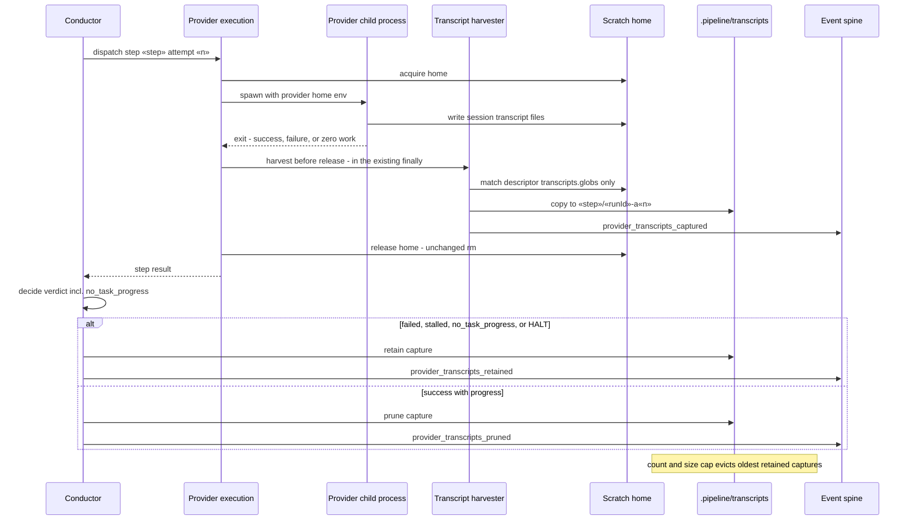
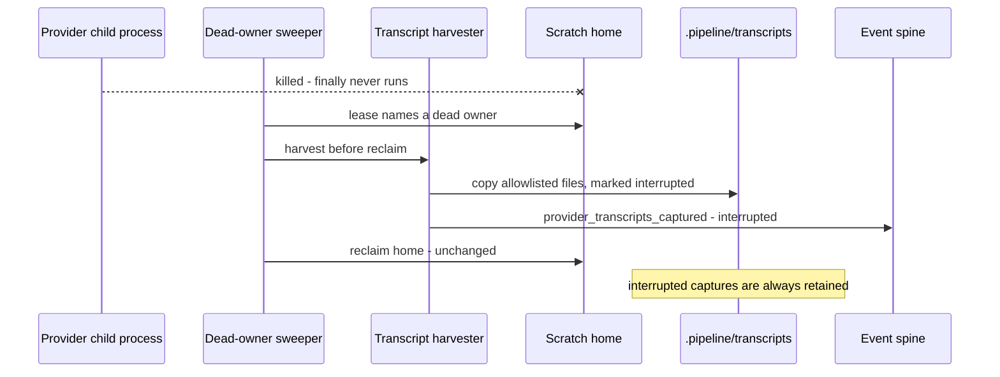
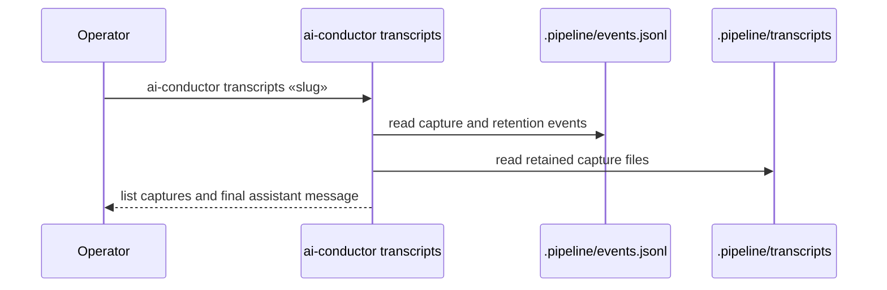

# Sequence: Capture, then retain or prune, a self-host provider transcript

**Last updated:** 2026-10-10
**Scope:** The two halves of #611 — harvest at scratch release (and at dead-owner sweep), and the
later keep/prune decision once the conductor has the step verdict.

## Diagram: normal attempt

## Diagram: killed attempt recovered by the sweep

## Diagram: operator post-mortem

## Change Log

| Date | Change | Reason |
|------|--------|--------|
| 2026-10-10 | Initial generation | #611 — self-build transcripts deleted on teardown |
