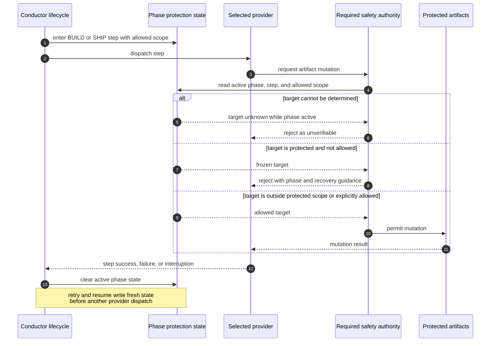

# Sequence: Provider-Neutral Protected Artifacts (#907)

**Last updated:** 2026-07-25
**Scope:** Phase-scoped protection for frozen DECIDE artifacts during BUILD and SHIP,
including allowed exceptions, unknown targets, retry, and resume.

## Diagram

## Negative and Recovery Paths

- Unknown mutation targets fail closed while a protected phase is active.
- A provider cannot infer permission from a missing or malformed protection context.
- Step-specific exceptions remain explicit and bounded; an unrelated artifact never
  becomes writable through a broad phase exemption.
- Cleanup occurs on success, failure, and interruption. Retry and resume establish a
  fresh context rather than silently weakening protection.

## Legend

- Protected artifacts are the approved product, architecture, story, and plan record
  frozen during BUILD and SHIP except for explicit lifecycle-owned updates.
- The selected provider may be Claude or Codex; the phase contract is the same.

## Change Log

| Date | Change | Reason |
|------|--------|--------|
| 2026-07-25 | Initial sequence | DECIDE architecture for issue #907 |
