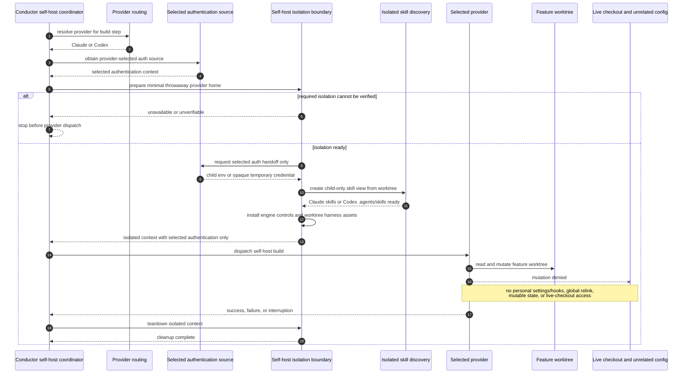

# Sequence: Provider-Neutral Self-Host Isolation (#907)

**Last updated:** 2026-07-26
**Scope:** A harness self-build under Claude or Codex, preserving issue #905's selected
authentication source while excluding unrelated operator configuration and protecting
the live checkout on every terminal path.

## Diagram

## Negative and Recovery Paths

- Isolation readiness is established before the provider runs; an unverifiable boundary
  never degrades into a normal dispatch.
- The selected authentication source is the only approved dependency on live provider
  state. Claude and Codex both exclude unrelated preferences, extensions, lifecycle
  customizations, histories, sessions, caches, and mutable state.
- Claude does not copy operator settings/personal hooks or relink live global skills;
  worktree skills and engine-owned controls are installed inside its throwaway home.
- Codex cached login is copied only as an opaque restricted credential artifact and is
  removed with the isolated home. #904's live user catalog is replaced only for the
  self-host child by a worktree-owned `.agents/skills` view.
- The provider may mutate the feature worktree but not the live harness checkout.
- Teardown is required after success, failure, or interruption. Retry and resume create
  a fresh isolated context with the same #905 authentication-selection rules.

## Legend

- `--x` denotes a denied mutation relationship.
- Issue #905 remains the authority for authentication selection and bounded execution;
  #907 owns the surrounding self-host configuration and checkout isolation outcome.

## Change Log

| Date | Change | Reason |
|------|--------|--------|
| 2026-07-26 | Apply minimal isolated-home behavior to both Claude and Codex | Conflict-check resolution for issue #907 |
| 2026-07-26 | Add opaque cached-auth handoff and isolated #904 skill discovery | Landed #905 and inflight #904 conflict resolution |
| 2026-07-25 | Initial sequence | DECIDE architecture for issue #907 |
